# System Architecture Analysis

## Overview

- **Project**: /home/tom/github/oqlos/testql
- **Primary Language**: yaml
- **Languages**: yaml: 96, python: 95, json: 2, shell: 2, yml: 2
- **Analysis Mode**: static
- **Total Functions**: 746
- **Total Classes**: 70
- **Modules**: 200
- **Entry Points**: 610

## Architecture by Module

### project.map.toon
- **Functions**: 204
- **File**: `map.toon.yaml`

### code2llm_output.map.toon
- **Functions**: 87
- **File**: `map.toon.yaml`

### testql.commands.encoder_routes
- **Functions**: 27
- **File**: `encoder_routes.py`

### testql._base_fallback
- **Functions**: 26
- **Classes**: 7
- **File**: `_base_fallback.py`

### testql.interpreter._testtoon_parser
- **Functions**: 24
- **Classes**: 2
- **File**: `_testtoon_parser.py`

### testql.openapi_generator
- **Functions**: 21
- **Classes**: 3
- **File**: `openapi_generator.py`

### testql.runner
- **Functions**: 18
- **Classes**: 3
- **File**: `runner.py`

### testql.generators.generators
- **Functions**: 17
- **Classes**: 4
- **File**: `generators.py`

### testql.generators.analyzers
- **Functions**: 16
- **Classes**: 1
- **File**: `analyzers.py`

### testql.sumd_parser
- **Functions**: 12
- **Classes**: 5
- **File**: `sumd_parser.py`

### testql.interpreter._encoder
- **Functions**: 12
- **Classes**: 1
- **File**: `_encoder.py`

### testql.detectors.fastapi_detector
- **Functions**: 12
- **Classes**: 1
- **File**: `fastapi_detector.py`

### testql.sumd_generator
- **Functions**: 11
- **File**: `sumd_generator.py`

### testql.interpreter._api_runner
- **Functions**: 10
- **Classes**: 1
- **File**: `_api_runner.py`

### testql.interpreter._gui
- **Functions**: 10
- **Classes**: 1
- **File**: `_gui.py`

### testql.interpreter._unit
- **Functions**: 10
- **Classes**: 1
- **File**: `_unit.py`

### testql.detectors.unified
- **Functions**: 10
- **Classes**: 1
- **File**: `unified.py`

### testql.doql_parser
- **Functions**: 9
- **Classes**: 1
- **File**: `doql_parser.py`

### testql.commands.templates.content
- **Functions**: 9
- **Classes**: 1
- **File**: `content.py`

### testql.commands.echo.parsers.doql
- **Functions**: 9
- **File**: `doql.py`

## Key Entry Points

Main execution flows into the system:

### testql.commands.generate_cmd.generate
> Generate TestQL scenarios from project structure.
- **Calls**: click.command, click.argument, click.option, click.option, click.option, Path, testql.commands.generate_cmd._is_workspace, sys.exit

### testql.commands.suite.cli.suite
> Run test suite(s) — predefined or custom pattern.
- **Calls**: click.command, click.argument, click.option, click.option, click.option, click.option, click.option, click.option

### testql.commands.misc_cmds.watch
> Watch for file changes and re-run tests automatically.
- **Calls**: click.command, click.option, click.option, click.option, click.option, None.resolve, click.echo, click.echo

### TODO.testtoon_parser.parse_testtoon
- **Calls**: text.splitlines, META_RE.match, None.startswith, HEADER_RE.match, raw.strip, raw.strip, None.strip, raw.strip

### testql.interpreter._shell.ShellMixin._cmd_shell
> SHELL "command" [timeout_ms] — Execute arbitrary shell command.

Examples:
    SHELL "ls -la"
    SHELL "python --version" 5000
    SHELL "cat file.tx
- **Calls**: args.strip, self.out.fail, args_clean.startswith, args_clean.startswith, args_clean.find, None.strip, args_clean.split, self.out.step

### testql.interpreter.main
> CLI entry point — unchanged from original.
- **Calls**: argparse.ArgumentParser, parser.add_argument, parser.add_argument, parser.add_argument, parser.add_argument, parser.add_argument, parser.add_argument, parser.add_argument

### testql.interpreter._unit.UnitMixin._cmd_unit_assert
> UNIT_ASSERT "module.function" "args_json" "expected" — Assert function returns expected value.

Examples:
    UNIT_ASSERT "math.sqrt" "[4]" "2.0"
    
- **Calls**: None.split, None.strip, None.strip, None.strip, len, self.out.fail, self.out.step, self.results.append

### testql.runner.main
- **Calls**: argparse.ArgumentParser, parser.add_argument, parser.add_argument, parser.add_argument, parser.add_argument, parser.add_argument, parser.parse_args, DslCliExecutor

### testql.interpreter._gui.GuiMixin._cmd_gui_assert_text
> GUI_ASSERT_TEXT "selector" "expected" — Assert element contains text.
- **Calls**: None.split, None.strip, None.strip, len, self.out.fail, self.out.step, self.results.append, self.out.fail

### testql.commands.misc_cmds.from_sumd
> Generate TestQL scenarios from SUMD.md documentation.
- **Calls**: click.command, click.argument, click.option, click.option, Path, SumdParser, click.echo, parser.parse_file

### testql.commands.endpoints_cmd.openapi
> Generate OpenAPI spec from detected endpoints.
- **Calls**: click.command, click.argument, click.option, click.option, click.option, click.option, click.option, Path

### testql.interpreter._gui.GuiMixin._cmd_gui_input
> GUI_INPUT "selector" "text" — Type text into element.

Examples:
    GUI_INPUT "[data-testid=search]" "hello world"
    GUI_INPUT "input#username" "te
- **Calls**: None.split, None.strip, None.strip, len, self.out.fail, self.out.step, self.results.append, self.out.fail

### testql.openapi_generator.ContractTestGenerator.generate_contract_tests
> Generate TestQL contract tests from OpenAPI spec.
- **Calls**: self.spec.get, paths.items, lines.append, lines.append, lines.append, lines.append, lines.append, lines.append

### testql.sumd_parser.SumdParser.generate_testql_scenarios
> Generate testql scenario content from SUMD document.
- **Calls**: lines.append, lines.append, lines.append, lines.append, lines.append, lines.append, lines.append, lines.append

### testql.commands.generate_cmd.analyze
> Analyze project structure and show testability report.
- **Calls**: click.command, click.argument, Path, TestGenerator, gen.analyze, click.echo, click.echo, click.echo

### testql.commands.misc_cmds.report
> Generate HTML report from test data.json.
- **Calls**: click.command, click.argument, click.option, click.option, code2llm_output.map.toon.generate_report, click.echo, click.echo, Path

### testql.interpreter._gui.GuiMixin._cmd_gui_assert_visible
> GUI_ASSERT_VISIBLE "selector" — Assert element is visible.
- **Calls**: None.strip, self.out.fail, self.out.step, self.results.append, self.out.fail, self.results.append, args.strip, StepResult

### testql.interpreter._gui.GuiMixin._cmd_gui_capture
> GUI_CAPTURE "selector" "screenshot.png" — Take screenshot of element or full page.

Examples:
    GUI_CAPTURE "" "full-page.png"  # Full page
    GUI_
- **Calls**: None.split, None.strip, None.strip, self.out.step, self.results.append, self.out.fail, self.results.append, self.out.step

### testql.commands.misc_cmds.create
> Create new test file from template.
- **Calls**: click.command, click.argument, click.option, click.option, click.option, click.option, out_dir.mkdir, TestContentBuilder.build

### testql.report_generator.generate_report
> Generate HTML report from data.json file.
- **Calls**: json.loads, data.get, round, TestSuiteReport, HTMLReportGenerator, generator.generate, data_json.read_text, data.get

### testql.runner.DslCliExecutor.run_script
> Execute a DSL script
- **Calls**: code2llm_output.map.toon.parse_script, print, print, print, print, enumerate, print, sum

### testql.echo_schemas.ProjectEcho.to_text
> Convert to human-readable text format.
- **Calls**: lines.append, lines.append, lines.append, lines.append, lines.append, lines.append, lines.append, lines.append

### testql.commands.misc_cmds.init
> Initialize TestQL project with templates and config.
- **Calls**: click.command, click.option, click.option, click.option, None.resolve, testql.commands.misc_cmds._create_templates, click.echo, click.echo

### testql.commands.misc_cmds.echo
> Generate AI-friendly project metadata echo from toon tests and doql model.
- **Calls**: click.command, click.option, click.option, click.option, click.option, click.option, ProjectEcho, Path

### testql.commands.run_cmd.run
> Run a TestQL (.testql.toon.yaml) scenario.
- **Calls**: click.command, click.argument, click.option, click.option, click.option, click.option, None.read_text, IqlInterpreter

### testql.commands.endpoints_cmd.endpoints
> List all detected API endpoints in a project.
- **Calls**: click.command, click.argument, click.option, click.option, click.option, click.option, Path, UnifiedEndpointDetector

### testql.doql_parser.DoqlParser.parse
> Parse doql LESS content.

Args:
    content: Doql LESS content
    
Returns:
    SystemModel: Extracted system model
- **Calls**: SystemModel, re.search, re.finditer, re.finditer, re.finditer, re.search, app_match.group, self._parse_app_block

### testql.interpreter._gui.GuiMixin._cmd_gui_click
> GUI_CLICK "selector" — Click element.

Examples:
    GUI_CLICK "[data-testid=submit-button]"
    GUI_CLICK "button#submit"
- **Calls**: None.strip, self.out.fail, self.out.step, self.results.append, self.out.fail, self.results.append, self.out.step, self.results.append

### testql.interpreter._flow.FlowMixin._cmd_wait_for
> WAIT_FOR "selector" VISIBLE 5000
WAIT_FOR NETWORK_IDLE 10000
- **Calls**: None.split, None.strip, self.out.step, time.time, self.out.step, self.results.append, len, self.out.step

### testql.sumd_parser.SumdParser._parse_testql_scenarios
> Parse testql scenarios from SUMD.
- **Calls**: re.finditer, match.group, match.group, re.finditer, re.search, None.split, type_match.group, scenarios.append

## Process Flows

Key execution flows identified:

### Flow 1: generate
```
generate [testql.commands.generate_cmd]
```

### Flow 2: suite
```
suite [testql.commands.suite.cli]
```

### Flow 3: watch
```
watch [testql.commands.misc_cmds]
```

### Flow 4: parse_testtoon
```
parse_testtoon [TODO.testtoon_parser]
```

### Flow 5: _cmd_shell
```
_cmd_shell [testql.interpreter._shell.ShellMixin]
```

### Flow 6: main
```
main [testql.interpreter]
```

### Flow 7: _cmd_unit_assert
```
_cmd_unit_assert [testql.interpreter._unit.UnitMixin]
```

### Flow 8: _cmd_gui_assert_text
```
_cmd_gui_assert_text [testql.interpreter._gui.GuiMixin]
```

### Flow 9: from_sumd
```
from_sumd [testql.commands.misc_cmds]
```

### Flow 10: openapi
```
openapi [testql.commands.endpoints_cmd]
```

## Key Classes

### testql.generators.analyzers.ProjectAnalyzer
> Analyzes project structure to discover testable patterns.
- **Methods**: 16
- **Key Methods**: testql.generators.analyzers.ProjectAnalyzer._detect_web_frontend, testql.generators.analyzers.ProjectAnalyzer._detect_python_type, testql.generators.analyzers.ProjectAnalyzer._has_argparse_usage, testql.generators.analyzers.ProjectAnalyzer._detect_hardware, testql.generators.analyzers.ProjectAnalyzer.detect_project_type, testql.generators.analyzers.ProjectAnalyzer.run_full_analysis, testql.generators.analyzers.ProjectAnalyzer._scan_directory_structure, testql.generators.analyzers.ProjectAnalyzer._collect_patterns_from_tree, testql.generators.analyzers.ProjectAnalyzer._analyze_python_tests, testql.generators.analyzers.ProjectAnalyzer._extract_test_pattern
- **Inherits**: BaseAnalyzer

### testql.runner.DslCliExecutor
- **Methods**: 15
- **Key Methods**: testql.runner.DslCliExecutor.__init__, testql.runner.DslCliExecutor.execute, testql.runner.DslCliExecutor._dispatch, testql.runner.DslCliExecutor.cmd_api, testql.runner.DslCliExecutor.cmd_wait, testql.runner.DslCliExecutor.cmd_log, testql.runner.DslCliExecutor.cmd_print, testql.runner.DslCliExecutor.cmd_store, testql.runner.DslCliExecutor.cmd_env, testql.runner.DslCliExecutor.cmd_assert_status

### testql.interpreter._encoder.EncoderMixin
> Mixin providing all ENCODER_* hardware control commands.
- **Methods**: 12
- **Key Methods**: testql.interpreter._encoder.EncoderMixin._encoder_url, testql.interpreter._encoder.EncoderMixin._encoder_do_http, testql.interpreter._encoder.EncoderMixin._encoder_call, testql.interpreter._encoder.EncoderMixin._cmd_encoder_on, testql.interpreter._encoder.EncoderMixin._cmd_encoder_off, testql.interpreter._encoder.EncoderMixin._cmd_encoder_scroll, testql.interpreter._encoder.EncoderMixin._cmd_encoder_click, testql.interpreter._encoder.EncoderMixin._cmd_encoder_dblclick, testql.interpreter._encoder.EncoderMixin._cmd_encoder_focus, testql.interpreter._encoder.EncoderMixin._cmd_encoder_status

### testql.detectors.fastapi_detector.FastAPIDetector
> Detect FastAPI endpoints using AST analysis.
- **Methods**: 12
- **Key Methods**: testql.detectors.fastapi_detector.FastAPIDetector.detect, testql.detectors.fastapi_detector.FastAPIDetector._analyze_file, testql.detectors.fastapi_detector.FastAPIDetector._detect_router_assignment, testql.detectors.fastapi_detector.FastAPIDetector._extract_router_prefix, testql.detectors.fastapi_detector.FastAPIDetector._detect_app_assignment, testql.detectors.fastapi_detector.FastAPIDetector._extract_include_router, testql.detectors.fastapi_detector.FastAPIDetector._analyze_route_handler, testql.detectors.fastapi_detector.FastAPIDetector._extract_route_info, testql.detectors.fastapi_detector.FastAPIDetector._get_router_prefix, testql.detectors.fastapi_detector.FastAPIDetector._extract_parameters
- **Inherits**: BaseEndpointDetector

### testql.interpreter._gui.GuiMixin
> Mixin providing desktop GUI test commands using Playwright.

Commands:
  - GUI_START "app_path" [arg
- **Methods**: 10
- **Key Methods**: testql.interpreter._gui.GuiMixin._init_gui_driver, testql.interpreter._gui.GuiMixin._cmd_gui_start, testql.interpreter._gui.GuiMixin._start_playwright, testql.interpreter._gui.GuiMixin._start_selenium, testql.interpreter._gui.GuiMixin._cmd_gui_click, testql.interpreter._gui.GuiMixin._cmd_gui_input, testql.interpreter._gui.GuiMixin._cmd_gui_assert_visible, testql.interpreter._gui.GuiMixin._cmd_gui_assert_text, testql.interpreter._gui.GuiMixin._cmd_gui_capture, testql.interpreter._gui.GuiMixin._cmd_gui_stop

### testql.interpreter._unit.UnitMixin
> Mixin providing unit test execution: UNIT_PYTEST, UNIT_IMPORT, UNIT_ASSERT.
- **Methods**: 10
- **Key Methods**: testql.interpreter._unit.UnitMixin._parse_pytest_args, testql.interpreter._unit.UnitMixin._extract_pytest_summary, testql.interpreter._unit.UnitMixin._run_pytest_subprocess, testql.interpreter._unit.UnitMixin._handle_pytest_dry_run, testql.interpreter._unit.UnitMixin._handle_pytest_success, testql.interpreter._unit.UnitMixin._handle_pytest_error, testql.interpreter._unit.UnitMixin._cmd_unit_pytest, testql.interpreter._unit.UnitMixin._cmd_unit_pytest_discover, testql.interpreter._unit.UnitMixin._cmd_unit_import, testql.interpreter._unit.UnitMixin._cmd_unit_assert

### testql.generators.generators.APIGeneratorMixin
> Mixin for generating API-focused test scenarios.
- **Methods**: 10
- **Key Methods**: testql.generators.generators.APIGeneratorMixin._generate_api_tests, testql.generators.generators.APIGeneratorMixin._build_api_test_header, testql.generators.generators.APIGeneratorMixin._build_api_test_config, testql.generators.generators.APIGeneratorMixin._build_rest_section, testql.generators.generators.APIGeneratorMixin._build_graphql_section, testql.generators.generators.APIGeneratorMixin._build_websocket_section, testql.generators.generators.APIGeneratorMixin._build_api_test_endpoints, testql.generators.generators.APIGeneratorMixin._deduplicate_rest_routes, testql.generators.generators.APIGeneratorMixin._build_api_test_assertions, testql.generators.generators.APIGeneratorMixin._build_api_test_summary

### testql.openapi_generator.OpenAPIGenerator
> Generate OpenAPI specs from detected endpoints.
- **Methods**: 9
- **Key Methods**: testql.openapi_generator.OpenAPIGenerator.__init__, testql.openapi_generator.OpenAPIGenerator.generate, testql.openapi_generator.OpenAPIGenerator._normalize_path, testql.openapi_generator.OpenAPIGenerator._build_operation, testql.openapi_generator.OpenAPIGenerator._infer_tags, testql.openapi_generator.OpenAPIGenerator._extract_parameters, testql.openapi_generator.OpenAPIGenerator._build_request_body, testql.openapi_generator.OpenAPIGenerator._build_responses, testql.openapi_generator.OpenAPIGenerator.save

### testql.sumd_parser.SumdParser
> Parser for SUMD markdown files.
- **Methods**: 9
- **Key Methods**: testql.sumd_parser.SumdParser.parse_file, testql.sumd_parser.SumdParser.parse, testql.sumd_parser.SumdParser._parse_metadata, testql.sumd_parser.SumdParser._parse_interfaces, testql.sumd_parser.SumdParser._parse_workflows, testql.sumd_parser.SumdParser._parse_testql_scenarios, testql.sumd_parser.SumdParser._parse_architecture, testql.sumd_parser.SumdParser._extract_section, testql.sumd_parser.SumdParser.generate_testql_scenarios

### testql.commands.templates.content.TestContentBuilder
> Builds test content for different test types.
- **Methods**: 9
- **Key Methods**: testql.commands.templates.content.TestContentBuilder.build, testql.commands.templates.content.TestContentBuilder._build_meta_header, testql.commands.templates.content.TestContentBuilder._build_standard_vars, testql.commands.templates.content.TestContentBuilder._build_gui, testql.commands.templates.content.TestContentBuilder._build_api, testql.commands.templates.content.TestContentBuilder._build_mixed, testql.commands.templates.content.TestContentBuilder._build_performance, testql.commands.templates.content.TestContentBuilder._build_workflow, testql.commands.templates.content.TestContentBuilder._build_encoder

### testql.detectors.unified.UnifiedEndpointDetector
> Unified detector that runs all specialized detectors.
- **Methods**: 9
- **Key Methods**: testql.detectors.unified.UnifiedEndpointDetector.__init__, testql.detectors.unified.UnifiedEndpointDetector.detect_all, testql.detectors.unified.UnifiedEndpointDetector._deduplicate_endpoints, testql.detectors.unified.UnifiedEndpointDetector.get_endpoints_by_type, testql.detectors.unified.UnifiedEndpointDetector.get_endpoints_by_framework, testql.detectors.unified.UnifiedEndpointDetector.generate_testql_scenario, testql.detectors.unified.UnifiedEndpointDetector._rest_block, testql.detectors.unified.UnifiedEndpointDetector._graphql_block, testql.detectors.unified.UnifiedEndpointDetector._ws_block

### testql.detectors.flask_detector.FlaskDetector
> Detect Flask endpoints including Blueprints.
- **Methods**: 9
- **Key Methods**: testql.detectors.flask_detector.FlaskDetector.detect, testql.detectors.flask_detector.FlaskDetector._analyze_flask_file, testql.detectors.flask_detector.FlaskDetector._detect_blueprint, testql.detectors.flask_detector.FlaskDetector._extract_blueprint_prefix, testql.detectors.flask_detector.FlaskDetector._analyze_flask_route, testql.detectors.flask_detector.FlaskDetector._extract_flask_route_info, testql.detectors.flask_detector.FlaskDetector._extract_route_path, testql.detectors.flask_detector.FlaskDetector._extract_route_methods, testql.detectors.flask_detector.FlaskDetector._apply_blueprint_prefix
- **Inherits**: BaseEndpointDetector

### testql.doql_parser.DoqlParser
> Parser for doql LESS files.
- **Methods**: 8
- **Key Methods**: testql.doql_parser.DoqlParser.__init__, testql.doql_parser.DoqlParser.parse_file, testql.doql_parser.DoqlParser.parse, testql.doql_parser.DoqlParser._parse_app_block, testql.doql_parser.DoqlParser._parse_entity_block, testql.doql_parser.DoqlParser._parse_workflow_block, testql.doql_parser.DoqlParser._parse_interface_block, testql.doql_parser.DoqlParser._parse_deploy_block

### testql._base_fallback.InterpreterOutput
> Collects interpreter output lines for display or testing.
- **Methods**: 8
- **Key Methods**: testql._base_fallback.InterpreterOutput.__init__, testql._base_fallback.InterpreterOutput.emit, testql._base_fallback.InterpreterOutput.info, testql._base_fallback.InterpreterOutput.ok, testql._base_fallback.InterpreterOutput.fail, testql._base_fallback.InterpreterOutput.warn, testql._base_fallback.InterpreterOutput.error, testql._base_fallback.InterpreterOutput.step

### testql.interpreter._websockets.WebSocketMixin
> Mixin for WebSocket testing support.
- **Methods**: 8
- **Key Methods**: testql.interpreter._websockets.WebSocketMixin.__init_subclass__, testql.interpreter._websockets.WebSocketMixin._get_ws_context, testql.interpreter._websockets.WebSocketMixin._cmd_ws_connect, testql.interpreter._websockets.WebSocketMixin._cmd_ws_send, testql.interpreter._websockets.WebSocketMixin._ws_do_receive, testql.interpreter._websockets.WebSocketMixin._cmd_ws_receive, testql.interpreter._websockets.WebSocketMixin._cmd_ws_assert_msg, testql.interpreter._websockets.WebSocketMixin._cmd_ws_close

### testql._base_fallback.VariableStore
> Simple key-value store with interpolation support.
- **Methods**: 7
- **Key Methods**: testql._base_fallback.VariableStore.__init__, testql._base_fallback.VariableStore.set, testql._base_fallback.VariableStore.get, testql._base_fallback.VariableStore.has, testql._base_fallback.VariableStore.all, testql._base_fallback.VariableStore.clear, testql._base_fallback.VariableStore.interpolate

### testql.interpreter._api_runner.ApiRunnerMixin
> Mixin providing HTTP API execution commands: API, CAPTURE.
- **Methods**: 7
- **Key Methods**: testql.interpreter._api_runner.ApiRunnerMixin._do_http_request, testql.interpreter._api_runner.ApiRunnerMixin._store_api_response, testql.interpreter._api_runner.ApiRunnerMixin._record_api_success, testql.interpreter._api_runner.ApiRunnerMixin._record_api_http_error, testql.interpreter._api_runner.ApiRunnerMixin._record_api_error, testql.interpreter._api_runner.ApiRunnerMixin._cmd_api, testql.interpreter._api_runner.ApiRunnerMixin._cmd_capture

### testql.interpreter.interpreter.IqlInterpreter
> IQL interpreter — runs .testql.toon.yaml / .iql / .tql scripts.

Supports both legacy IQL format and
- **Methods**: 7
- **Key Methods**: testql.interpreter.interpreter.IqlInterpreter.__init__, testql.interpreter.interpreter.IqlInterpreter.parse, testql.interpreter.interpreter.IqlInterpreter._is_testtoon, testql.interpreter.interpreter.IqlInterpreter.execute, testql.interpreter.interpreter.IqlInterpreter._dispatch, testql.interpreter.interpreter.IqlInterpreter._cmd_set, testql.interpreter.interpreter.IqlInterpreter._cmd_get
- **Inherits**: ApiRunnerMixin, AssertionsMixin, EncoderMixin, FlowMixin, GuiMixin, ShellMixin, UnitMixin, WebSocketMixin, BaseInterpreter

### testql.toon_parser.ToonParser
> Parser for toon test files.
- **Methods**: 6
- **Key Methods**: testql.toon_parser.ToonParser.__init__, testql.toon_parser.ToonParser.parse_file, testql.toon_parser.ToonParser.parse, testql.toon_parser.ToonParser._parse_api_block, testql.toon_parser.ToonParser._parse_assert_block, testql.toon_parser.ToonParser._parse_log_block

### testql._base_fallback.BaseInterpreter
> Abstract base for language interpreters.
- **Methods**: 6
- **Key Methods**: testql._base_fallback.BaseInterpreter.__init__, testql._base_fallback.BaseInterpreter.parse, testql._base_fallback.BaseInterpreter.execute, testql._base_fallback.BaseInterpreter.run, testql._base_fallback.BaseInterpreter.run_file, testql._base_fallback.BaseInterpreter.strip_comments
- **Inherits**: ABC

## Data Transformation Functions

Key functions that process and transform data:

### code2llm_output.map.toon._parse_api_args

### code2llm_output.map.toon._parse_meta_from_args

### code2llm_output.map.toon._parse_target_from_args

### code2llm_output.map.toon.convert_iql_to_testtoon

### code2llm_output.map.toon.convert_file

### code2llm_output.map.toon.convert_directory

### code2llm_output.map.toon.parse_doql_less

### code2llm_output.map.toon.parse_toon_scenarios

### code2llm_output.map.toon.format_text_output

### code2llm_output.map.toon.parse_value

### code2llm_output.map.toon.parse_testtoon

### code2llm_output.map.toon.validate

### code2llm_output.map.toon.print_parsed

### code2llm_output.map.toon.parse_line

### code2llm_output.map.toon.parse_script

### code2llm_output.map.toon.parse_sumd_file

### code2llm_output.map.toon._parse_value

### code2llm_output.map.toon.validate_testtoon

### code2llm_output.map.toon._expand_encoder

### code2llm_output.map.toon._format_log_detail

### code2llm_output.map.toon._exec_encoder_cmd

### code2llm_output.map.toon.parse_doql_file

### code2llm_output.map.toon.parse_iql

### code2llm_output.map.toon.parse_toon_file

### TODO.testtoon_parser.Section.validate
- **Output to**: errors.append, len, len

## Behavioral Patterns

### recursion_parse_value
- **Type**: recursion
- **Confidence**: 0.90
- **Functions**: TODO.testtoon_parser.parse_value

### state_machine_EventBridge
- **Type**: state_machine
- **Confidence**: 0.70
- **Functions**: testql._base_fallback.EventBridge.__init__, testql._base_fallback.EventBridge.connect, testql._base_fallback.EventBridge.disconnect, testql._base_fallback.EventBridge.send_event, testql._base_fallback.EventBridge.connected

## Public API Surface

Functions exposed as public API (no underscore prefix):

- `testql.commands.generate_cmd.generate` - 44 calls
- `testql.commands.suite.cli.suite` - 36 calls
- `testql.commands.misc_cmds.watch` - 35 calls
- `TODO.testtoon_parser.parse_testtoon` - 31 calls
- `testql.interpreter.main` - 26 calls
- `testql.runner.main` - 24 calls
- `testql.commands.misc_cmds.from_sumd` - 23 calls
- `testql.commands.endpoints_cmd.openapi` - 23 calls
- `testql.openapi_generator.ContractTestGenerator.generate_contract_tests` - 22 calls
- `testql.sumd_parser.SumdParser.generate_testql_scenarios` - 22 calls
- `testql.commands.generate_cmd.analyze` - 22 calls
- `testql.commands.misc_cmds.report` - 22 calls
- `testql.commands.misc_cmds.create` - 21 calls
- `testql.report_generator.generate_report` - 20 calls
- `testql.runner.parse_line` - 20 calls
- `testql.runner.DslCliExecutor.run_script` - 20 calls
- `testql.echo_schemas.ProjectEcho.to_text` - 20 calls
- `testql.commands.misc_cmds.init` - 20 calls
- `testql.commands.misc_cmds.echo` - 20 calls
- `testql.commands.run_cmd.run` - 20 calls
- `testql.commands.endpoints_cmd.endpoints` - 20 calls
- `testql.doql_parser.DoqlParser.parse` - 19 calls
- `testql.openapi_generator.ContractTestGenerator.validate_response` - 17 calls
- `testql.commands.echo.cli.echo` - 17 calls
- `testql.runner.DslCliExecutor.cmd_assert_json` - 16 calls
- `testql.interpreter.interpreter.IqlInterpreter.execute` - 16 calls
- `testql.commands.encoder_routes.iql_run_file` - 15 calls
- `testql.interpreter._testtoon_parser.parse_testtoon` - 15 calls
- `testql.reporters.junit.JUnitReporter.generate` - 15 calls
- `TODO.testtoon_parser.parse_value` - 14 calls
- `testql.commands.encoder_routes.iql_list_files` - 14 calls
- `testql.toon_parser.ToonParser.parse` - 13 calls
- `testql.commands.suite.cli.list_tests` - 13 calls
- `testql.interpreter.dispatcher.CommandDispatcher.dispatch` - 13 calls
- `testql.reporters.console.report_console` - 13 calls
- `TODO.testtoon_parser.print_parsed` - 12 calls
- `testql.interpreter.converter.renderer.render_sections` - 12 calls
- `testql.commands.encoder_routes.iql_read_file` - 11 calls
- `testql.commands.encoder_routes.iql_list_tables` - 11 calls
- `testql.commands.encoder_routes.iql_read_log` - 11 calls

## System Interactions

How components interact:

```mermaid
graph TD
    generate --> command
    generate --> argument
    generate --> option
    suite --> command
    suite --> argument
    suite --> option
    watch --> command
    watch --> option
    parse_testtoon --> splitlines
    parse_testtoon --> match
    parse_testtoon --> startswith
    parse_testtoon --> strip
    _cmd_shell --> strip
    _cmd_shell --> fail
    _cmd_shell --> startswith
    _cmd_shell --> find
    main --> ArgumentParser
    main --> add_argument
    _cmd_unit_assert --> split
    _cmd_unit_assert --> strip
    _cmd_unit_assert --> len
    _cmd_gui_assert_text --> split
    _cmd_gui_assert_text --> strip
    _cmd_gui_assert_text --> len
    _cmd_gui_assert_text --> fail
    from_sumd --> command
    from_sumd --> argument
    from_sumd --> option
    from_sumd --> Path
    openapi --> command
```



## Reverse Engineering Guidelines

1. **Entry Points**: Start analysis from the entry points listed above
2. **Core Logic**: Focus on classes with many methods
3. **Data Flow**: Follow data transformation functions
4. **Process Flows**: Use the flow diagrams for execution paths
5. **API Surface**: Public API functions reveal the interface

## Context for LLM

Maintain the identified architectural patterns and public API surface when suggesting changes.