# System Architecture Analysis

## Overview

- **Project**: /home/tom/github/oqlos/testql
- **Primary Language**: python
- **Languages**: python: 223, yaml: 127, shell: 20, txt: 4, json: 2
- **Analysis Mode**: static
- **Total Functions**: 2150
- **Total Classes**: 195
- **Modules**: 397
- **Entry Points**: 1611

## Architecture by Module

### project.map.toon
- **Functions**: 783
- **File**: `map.toon.yaml`

### code2llm_output.map.toon
- **Functions**: 87
- **File**: `map.toon.yaml`

### testql.adapters.scenario_yaml
- **Functions**: 43
- **Classes**: 1
- **File**: `scenario_yaml.py`

### testql.interpreter._testtoon_parser
- **Functions**: 38
- **Classes**: 2
- **File**: `_testtoon_parser.py`

### testql.results.analyzer
- **Functions**: 38
- **File**: `analyzer.py`

### testql.interpreter._gui
- **Functions**: 34
- **Classes**: 1
- **File**: `_gui.py`

### testql.adapters.testtoon_adapter
- **Functions**: 32
- **Classes**: 1
- **File**: `testtoon_adapter.py`

### testql.generators.page_analyzer
- **Functions**: 31
- **Classes**: 1
- **File**: `page_analyzer.py`

### testql.adapters.nl.nl_adapter
- **Functions**: 30
- **Classes**: 1
- **File**: `nl_adapter.py`

### testql.commands.encoder_routes
- **Functions**: 27
- **File**: `encoder_routes.py`

### testql._base_fallback
- **Functions**: 26
- **Classes**: 7
- **File**: `_base_fallback.py`

### testql.interpreter.dom_scanner
- **Functions**: 26
- **Classes**: 1
- **File**: `dom_scanner.py`

### testql.adapters.sql.sql_adapter
- **Functions**: 26
- **Classes**: 1
- **File**: `sql_adapter.py`

### testql.adapters.graphql.graphql_adapter
- **Functions**: 23
- **Classes**: 1
- **File**: `graphql_adapter.py`

### testql.generators.sources.oql_source
- **Functions**: 22
- **Classes**: 1
- **File**: `oql_source.py`

### testql.openapi_generator
- **Functions**: 21
- **Classes**: 3
- **File**: `openapi_generator.py`

### testql.generators.sources.oql_parser
- **Functions**: 20
- **Classes**: 1
- **File**: `oql_parser.py`

### testql.ir.steps
- **Functions**: 19
- **Classes**: 10
- **File**: `steps.py`

### testql.discovery.probes.filesystem.package_python
- **Functions**: 19
- **Classes**: 1
- **File**: `package_python.py`

### testql.generators.api_generator
- **Functions**: 19
- **Classes**: 2
- **File**: `api_generator.py`

## Key Entry Points

Main execution flows into the system:

### testql.interpreter.dom_scan_mixin.DomScanMixin._cmd_dom_scan
> DOM_SCAN <type> [--output <format>] [--out-file <path>]
- **Calls**: args.split, None.lower, self.out.fail, self.results.append, len, getattr, self.out.fail, self.out.info

### testql.commands.suite.cli.suite
> Run test suite(s) — predefined or custom pattern.
- **Calls**: click.command, click.argument, click.option, click.option, click.option, click.option, click.option, click.option

### testql.generators.sources.pytest_source.PytestSource.to_oql
> Convert Unified IR to OQL commands.
- **Calls**: ir.get, lines.append, lines.append, lines.append, meta.get, lines.append, ir.get, ir.get

### testql.commands.misc_cmds.watch
> Watch for file changes and re-run tests automatically.
- **Calls**: click.command, click.option, click.option, click.option, click.option, None.resolve, click.echo, click.echo

### TODO.testtoon_parser.parse_testtoon
- **Calls**: text.splitlines, META_RE.match, None.startswith, HEADER_RE.match, raw.strip, raw.strip, None.strip, raw.strip

### testql.commands.heal_scenario_cmd.heal_scenario
> Validate and heal selectors in an existing TestTOON scenario.
- **Calls**: click.command, click.argument, click.option, click.option, click.option, click.option, click.option, file.read_text

### testql.interpreter._assertions.AssertionsMixin._cmd_assert_json
> ASSERT_JSON path op value — e.g. ASSERT_JSON data.length > 0
- **Calls**: None.split, path.startswith, None.strip, literal.lower, _COMPARE_OPS.get, len, self.out.warn, re.match

### testql.interpreter._shell.ShellMixin._cmd_shell
> SHELL "command" [timeout_ms] — Execute arbitrary shell command.

Examples:
    SHELL "ls -la"
    SHELL "python --version" 5000
    SHELL "cat file.tx
- **Calls**: args.strip, self.out.fail, args_clean.startswith, args_clean.startswith, args_clean.find, None.strip, args_clean.split, self.out.step

### testql.interpreter._assertions.AssertionsMixin._cmd_assert_schema
> ASSERT_SCHEMA <schema_file_or_json> — Validate response against JSON schema.

Examples:
    ASSERT_SCHEMA "schemas/user.json"
    ASSERT_SCHEMA '{"typ
- **Calls**: None.strip, self.out.warn, jsonschema.validate, self.out.step, self.results.append, args.strip, schema_input.startswith, schema_input.startswith

### testql.interpreter._gui.GuiMixin._cmd_gui_navigate
> GUI_NAVIGATE "path_or_url" — Navigate to another page.

Examples:
    GUI_NAVIGATE "/connect-id"
    GUI_NAVIGATE "http://google.com"
- **Calls**: None.strip, self.out.fail, self.out.step, self.results.append, self.out.fail, self.results.append, self.out.step, self.results.append

### testql.interpreter._assertions.AssertionsMixin._cmd_assert_cookies
> ASSERT_COOKIES <cookie_name> <op> <expected> — Assert cookie value.

Examples:
    ASSERT_COOKIES session_id exists
    ASSERT_COOKIES session_id == "
- **Calls**: None.split, self.vars.get, headers.get, isinstance, cookie_header.split, cookies.get, len, self.out.warn

### testql.commands.run_cmd.run
> Run a TestQL (.testql.toon.yaml) scenario.
- **Calls**: click.command, click.argument, click.option, click.option, click.option, click.option, click.option, click.option

### testql.discovery.probes.browser.playwright_page.PlaywrightPageProbe.probe
- **Calls**: self.result, ImportError, self.result, sync_playwright, p.chromium.launch, browser.new_page, page.on, page.on

### testql.commands.generate_from_page_cmd.generate_from_page
> Auto-generate a TestTOON GUI scenario from a live URL.
- **Calls**: click.command, click.argument, click.option, click.option, click.option, click.option, click.option, None.render

### testql.interpreter.main
> CLI entry point — unchanged from original.
- **Calls**: argparse.ArgumentParser, parser.add_argument, parser.add_argument, parser.add_argument, parser.add_argument, parser.add_argument, parser.add_argument, parser.add_argument

### testql.interpreter._unit.UnitMixin._cmd_unit_assert
> UNIT_ASSERT "module.function" "args_json" "expected" — Assert function returns expected value.

Examples:
    UNIT_ASSERT "math.sqrt" "[4]" "2.0"
    
- **Calls**: None.split, None.strip, None.strip, None.strip, len, self.out.fail, self.out.step, self.results.append

### testql.interpreter._gui.GuiMixin._cmd_gui_assert_visible
> GUI_ASSERT_VISIBLE "selector" — Assert element is visible.
- **Calls**: None.strip, self._find_element_with_logging, self.out.fail, self.out.step, self.results.append, self.out.fail, self.results.append, self.out.step

### testql.runner.main
- **Calls**: argparse.ArgumentParser, parser.add_argument, parser.add_argument, parser.add_argument, parser.add_argument, parser.add_argument, parser.parse_args, DslCliExecutor

### testql.commands.generate_topology_cmd.generate_topology
> Generate an executable scenario from a topology trace.
- **Calls**: click.command, click.argument, click.option, click.option, click.option, click.option, project.map.toon.build_topology, testql.commands.generate_topology_cmd._pick_trace

### testql.commands.inspect_cmd.inspect
- **Calls**: click.command, click.argument, click.option, click.option, click.option, click.option, click.option, Path

### testql.interpreter._gui.GuiMixin._cmd_gui_assert_text
> GUI_ASSERT_TEXT "selector" "expected" — Assert element contains text.
- **Calls**: None.split, None.strip, None.strip, len, self.out.fail, self.out.step, self.results.append, self.out.fail

### testql.interpreter.dom_scan_mixin.DomScanMixin._cmd_assert_taborder
- **Calls**: shlex.split, DomScanner, scanner.assert_taborder, len, self.out.fail, self.results.append, int, getattr

### testql.generators.api_generator.APIGeneratorMixin._generate_api_tests
> Generate comprehensive API tests from discovered routes.
- **Calls**: self.profile.config.get, self.profile.config.get, self._validate_endpoints, self._build_api_test_header, sections.extend, sections.extend, sections.extend, sections.extend

### testql.adapters.testtoon_adapter._api_section_to_steps
- **Calls**: steps.append, row.get, row.get, asserts.append, row.get, asserts.append, None.strip, ApiStep

### testql.commands.misc_cmds.from_sumd
> Generate TestQL scenarios from SUMD.md documentation.
- **Calls**: click.command, click.argument, click.option, click.option, Path, SumdParser, click.echo, parser.parse_file

### testql.commands.endpoints_cmd.openapi
> Generate OpenAPI spec from detected endpoints.
- **Calls**: click.command, click.argument, click.option, click.option, click.option, click.option, click.option, Path

### testql.interpreter._gui.GuiMixin._cmd_gui_input
> GUI_INPUT "selector" "text" — Type text into element.

Examples:
    GUI_INPUT "[data-testid=search]" "hello world"
    GUI_INPUT "input#username" "te
- **Calls**: None.split, None.strip, None.strip, len, self.out.fail, self.out.step, self.results.append, self.out.fail

### testql.adapters.scenario_yaml._gui_step
- **Calls**: testql.adapters.scenario_yaml._step_common, GuiStep, GuiStep, str, GuiStep, str, GuiStep, str

### testql.openapi_generator.ContractTestGenerator.generate_contract_tests
> Generate TestQL contract tests from OpenAPI spec.
- **Calls**: self.spec.get, paths.items, lines.append, lines.append, lines.append, lines.append, lines.append, lines.append

### testql.sumd_parser.SumdParser.generate_testql_scenarios
> Generate testql scenario content from SUMD document.
- **Calls**: lines.append, lines.append, lines.append, lines.append, lines.append, lines.append, lines.append, lines.append

## Process Flows

Key execution flows identified:

### Flow 1: _cmd_dom_scan
```
_cmd_dom_scan [testql.interpreter.dom_scan_mixin.DomScanMixin]
```

### Flow 2: suite
```
suite [testql.commands.suite.cli]
```

### Flow 3: to_oql
```
to_oql [testql.generators.sources.pytest_source.PytestSource]
```

### Flow 4: watch
```
watch [testql.commands.misc_cmds]
```

### Flow 5: parse_testtoon
```
parse_testtoon [TODO.testtoon_parser]
```

### Flow 6: heal_scenario
```
heal_scenario [testql.commands.heal_scenario_cmd]
```

### Flow 7: _cmd_assert_json
```
_cmd_assert_json [testql.interpreter._assertions.AssertionsMixin]
```

### Flow 8: _cmd_shell
```
_cmd_shell [testql.interpreter._shell.ShellMixin]
```

### Flow 9: _cmd_assert_schema
```
_cmd_assert_schema [testql.interpreter._assertions.AssertionsMixin]
```

### Flow 10: _cmd_gui_navigate
```
_cmd_gui_navigate [testql.interpreter._gui.GuiMixin]
```

## Key Classes

### testql.interpreter._gui.GuiMixin
> Mixin providing desktop GUI test commands using Playwright.

Commands:
  - GUI_START (START) "path" 
- **Methods**: 34
- **Key Methods**: testql.interpreter._gui.GuiMixin._resolve_selector_with_fallback, testql.interpreter._gui.GuiMixin._generate_fallback_selectors, testql.interpreter._gui.GuiMixin._get_class_fallbacks, testql.interpreter._gui.GuiMixin._get_id_fallbacks, testql.interpreter._gui.GuiMixin._get_role_based_fallbacks, testql.interpreter._gui.GuiMixin._get_button_text_fallbacks, testql.interpreter._gui.GuiMixin._try_selectors, testql.interpreter._gui.GuiMixin._try_single_selector, testql.interpreter._gui.GuiMixin._find_element_with_logging, testql.interpreter._gui.GuiMixin._init_gui_driver

### testql.interpreter.dom_scanner.DomScanner
- **Methods**: 24
- **Key Methods**: testql.interpreter.dom_scanner.DomScanner.__init__, testql.interpreter.dom_scanner.DomScanner.scan_focusable, testql.interpreter.dom_scanner.DomScanner.scan_aria, testql.interpreter.dom_scanner.DomScanner.scan_interactive, testql.interpreter.dom_scanner.DomScanner.scan_taborder, testql.interpreter.dom_scanner.DomScanner.audit_buttons, testql.interpreter.dom_scanner.DomScanner._should_skip_button, testql.interpreter.dom_scanner.DomScanner._audit_single_button, testql.interpreter.dom_scanner.DomScanner._setup_mutation_observer, testql.interpreter.dom_scanner.DomScanner._classify_button_result

### testql.generators.sources.oql_source.OqlSource
> Source adapter for OQL/CQL scenario files.
- **Methods**: 22
- **Key Methods**: testql.generators.sources.oql_source.OqlSource.load, testql.generators.sources.oql_source.OqlSource.ingest, testql.generators.sources.oql_source.OqlSource._to_unified_ir, testql.generators.sources.oql_source.OqlSource._detect_scenario_type, testql.generators.sources.oql_source.OqlSource._convert_command, testql.generators.sources.oql_source.OqlSource._convert_set, testql.generators.sources.oql_source.OqlSource._convert_read, testql.generators.sources.oql_source.OqlSource._convert_write, testql.generators.sources.oql_source.OqlSource._convert_check, testql.generators.sources.oql_source.OqlSource._convert_wait
- **Inherits**: BaseSource

### testql.generators.sources.oql_parser.OqlParser
> Parse OQL/CQL scenario files.

OQL (Object Query Language) and CQL (Command Query Language) are comm
- **Methods**: 20
- **Key Methods**: testql.generators.sources.oql_parser.OqlParser.parse_file, testql.generators.sources.oql_parser.OqlParser._read_file_content, testql.generators.sources.oql_parser.OqlParser._should_skip_line, testql.generators.sources.oql_parser.OqlParser._extract_metadata_from_comment, testql.generators.sources.oql_parser.OqlParser._handle_sequence_block, testql.generators.sources.oql_parser.OqlParser._categorize_command, testql.generators.sources.oql_parser.OqlParser._parse_command, testql.generators.sources.oql_parser.OqlParser._create_command_from_match, testql.generators.sources.oql_parser.OqlParser._parse_set_command, testql.generators.sources.oql_parser.OqlParser._parse_read_command

### testql.generators.api_generator.APIGeneratorMixin
> Mixin for generating API-focused test scenarios.
- **Methods**: 18
- **Key Methods**: testql.generators.api_generator.APIGeneratorMixin._generate_api_tests, testql.generators.api_generator.APIGeneratorMixin._validate_endpoints, testql.generators.api_generator.APIGeneratorMixin._validate_single_endpoint, testql.generators.api_generator.APIGeneratorMixin._try_endpoint_request, testql.generators.api_generator.APIGeneratorMixin._sleep_with_backoff, testql.generators.api_generator.APIGeneratorMixin._log_validation_summary, testql.generators.api_generator.APIGeneratorMixin._build_api_test_header, testql.generators.api_generator.APIGeneratorMixin._build_api_test_config, testql.generators.api_generator.APIGeneratorMixin._build_api_test_preamble, testql.generators.api_generator.APIGeneratorMixin._build_api_test_captures

### testql.topology.generator.TopologyScenarioGenerator
> Generate executable TestPlans from topology traversal traces.
- **Methods**: 17
- **Key Methods**: testql.topology.generator.TopologyScenarioGenerator.__init__, testql.topology.generator.TopologyScenarioGenerator.from_trace, testql.topology.generator.TopologyScenarioGenerator.from_path, testql.topology.generator.TopologyScenarioGenerator.to_testtoon, testql.topology.generator.TopologyScenarioGenerator._node_to_step, testql.topology.generator.TopologyScenarioGenerator._interface_to_step, testql.topology.generator.TopologyScenarioGenerator._page_to_step, testql.topology.generator.TopologyScenarioGenerator._link_to_step, testql.topology.generator.TopologyScenarioGenerator._form_to_step, testql.topology.generator.TopologyScenarioGenerator._asset_to_step

### testql.generators.analyzers.ProjectAnalyzer
> Analyzes project structure to discover testable patterns.
- **Methods**: 16
- **Key Methods**: testql.generators.analyzers.ProjectAnalyzer._detect_web_frontend, testql.generators.analyzers.ProjectAnalyzer._detect_python_type, testql.generators.analyzers.ProjectAnalyzer._has_argparse_usage, testql.generators.analyzers.ProjectAnalyzer._detect_hardware, testql.generators.analyzers.ProjectAnalyzer.detect_project_type, testql.generators.analyzers.ProjectAnalyzer.run_full_analysis, testql.generators.analyzers.ProjectAnalyzer._scan_directory_structure, testql.generators.analyzers.ProjectAnalyzer._collect_patterns_from_tree, testql.generators.analyzers.ProjectAnalyzer._analyze_python_tests, testql.generators.analyzers.ProjectAnalyzer._extract_test_pattern
- **Inherits**: BaseAnalyzer

### testql.runner.DslCliExecutor
- **Methods**: 15
- **Key Methods**: testql.runner.DslCliExecutor.__init__, testql.runner.DslCliExecutor.execute, testql.runner.DslCliExecutor._dispatch, testql.runner.DslCliExecutor.cmd_api, testql.runner.DslCliExecutor.cmd_wait, testql.runner.DslCliExecutor.cmd_log, testql.runner.DslCliExecutor.cmd_print, testql.runner.DslCliExecutor.cmd_store, testql.runner.DslCliExecutor.cmd_env, testql.runner.DslCliExecutor.cmd_assert_status

### testql.interpreter._encoder.EncoderMixin
> Mixin providing all ENCODER_* hardware control commands.
- **Methods**: 13
- **Key Methods**: testql.interpreter._encoder.EncoderMixin._encoder_url, testql.interpreter._encoder.EncoderMixin._encoder_prefix, testql.interpreter._encoder.EncoderMixin._encoder_do_http, testql.interpreter._encoder.EncoderMixin._encoder_call, testql.interpreter._encoder.EncoderMixin._cmd_encoder_on, testql.interpreter._encoder.EncoderMixin._cmd_encoder_off, testql.interpreter._encoder.EncoderMixin._cmd_encoder_scroll, testql.interpreter._encoder.EncoderMixin._cmd_encoder_click, testql.interpreter._encoder.EncoderMixin._cmd_encoder_dblclick, testql.interpreter._encoder.EncoderMixin._cmd_encoder_focus

### testql.adapters.registry.AdapterRegistry
> In-process registry of `BaseDSLAdapter` instances.

Adapters register themselves on import (or are r
- **Methods**: 12
- **Key Methods**: testql.adapters.registry.AdapterRegistry.__init__, testql.adapters.registry.AdapterRegistry.register, testql.adapters.registry.AdapterRegistry.register_plugin, testql.adapters.registry.AdapterRegistry.register_module, testql.adapters.registry.AdapterRegistry.load_plugins, testql.adapters.registry.AdapterRegistry.ensure_plugins_loaded, testql.adapters.registry.AdapterRegistry.unregister, testql.adapters.registry.AdapterRegistry.clear, testql.adapters.registry.AdapterRegistry.get, testql.adapters.registry.AdapterRegistry.all

### testql.detectors.fastapi_detector.FastAPIDetector
> Detect FastAPI endpoints using AST analysis.
- **Methods**: 12
- **Key Methods**: testql.detectors.fastapi_detector.FastAPIDetector.detect, testql.detectors.fastapi_detector.FastAPIDetector._analyze_file, testql.detectors.fastapi_detector.FastAPIDetector._detect_router_assignment, testql.detectors.fastapi_detector.FastAPIDetector._extract_router_prefix, testql.detectors.fastapi_detector.FastAPIDetector._detect_app_assignment, testql.detectors.fastapi_detector.FastAPIDetector._extract_include_router, testql.detectors.fastapi_detector.FastAPIDetector._analyze_route_handler, testql.detectors.fastapi_detector.FastAPIDetector._extract_route_info, testql.detectors.fastapi_detector.FastAPIDetector._get_router_prefix, testql.detectors.fastapi_detector.FastAPIDetector._extract_parameters
- **Inherits**: BaseEndpointDetector

### testql.detectors.unified.UnifiedEndpointDetector
> Unified detector that runs all specialized detectors.
- **Methods**: 11
- **Key Methods**: testql.detectors.unified.UnifiedEndpointDetector.__init__, testql.detectors.unified.UnifiedEndpointDetector.detect_all, testql.detectors.unified.UnifiedEndpointDetector.validate_endpoints, testql.detectors.unified.UnifiedEndpointDetector.detect_and_validate, testql.detectors.unified.UnifiedEndpointDetector._deduplicate_endpoints, testql.detectors.unified.UnifiedEndpointDetector.get_endpoints_by_type, testql.detectors.unified.UnifiedEndpointDetector.get_endpoints_by_framework, testql.detectors.unified.UnifiedEndpointDetector.generate_testql_scenario, testql.detectors.unified.UnifiedEndpointDetector._rest_block, testql.detectors.unified.UnifiedEndpointDetector._graphql_block

### testql.interpreter._unit.UnitMixin
> Mixin providing unit test execution: UNIT_PYTEST, UNIT_IMPORT, UNIT_ASSERT.
- **Methods**: 10
- **Key Methods**: testql.interpreter._unit.UnitMixin._parse_pytest_args, testql.interpreter._unit.UnitMixin._extract_pytest_summary, testql.interpreter._unit.UnitMixin._run_pytest_subprocess, testql.interpreter._unit.UnitMixin._handle_pytest_dry_run, testql.interpreter._unit.UnitMixin._handle_pytest_success, testql.interpreter._unit.UnitMixin._handle_pytest_error, testql.interpreter._unit.UnitMixin._cmd_unit_pytest, testql.interpreter._unit.UnitMixin._cmd_unit_pytest_discover, testql.interpreter._unit.UnitMixin._cmd_unit_import, testql.interpreter._unit.UnitMixin._cmd_unit_assert

### testql.openapi_generator.OpenAPIGenerator
> Generate OpenAPI specs from detected endpoints.
- **Methods**: 9
- **Key Methods**: testql.openapi_generator.OpenAPIGenerator.__init__, testql.openapi_generator.OpenAPIGenerator.generate, testql.openapi_generator.OpenAPIGenerator._normalize_path, testql.openapi_generator.OpenAPIGenerator._build_operation, testql.openapi_generator.OpenAPIGenerator._infer_tags, testql.openapi_generator.OpenAPIGenerator._extract_parameters, testql.openapi_generator.OpenAPIGenerator._build_request_body, testql.openapi_generator.OpenAPIGenerator._build_responses, testql.openapi_generator.OpenAPIGenerator.save

### testql.sumd_parser.SumdParser
> Parser for SUMD markdown files.
- **Methods**: 9
- **Key Methods**: testql.sumd_parser.SumdParser.parse_file, testql.sumd_parser.SumdParser.parse, testql.sumd_parser.SumdParser._parse_metadata, testql.sumd_parser.SumdParser._parse_interfaces, testql.sumd_parser.SumdParser._parse_workflows, testql.sumd_parser.SumdParser._parse_testql_scenarios, testql.sumd_parser.SumdParser._parse_architecture, testql.sumd_parser.SumdParser._extract_section, testql.sumd_parser.SumdParser.generate_testql_scenarios

### testql.commands.templates.content.TestContentBuilder
> Builds test content for different test types.
- **Methods**: 9
- **Key Methods**: testql.commands.templates.content.TestContentBuilder.build, testql.commands.templates.content.TestContentBuilder._build_meta_header, testql.commands.templates.content.TestContentBuilder._build_standard_vars, testql.commands.templates.content.TestContentBuilder._build_gui, testql.commands.templates.content.TestContentBuilder._build_api, testql.commands.templates.content.TestContentBuilder._build_mixed, testql.commands.templates.content.TestContentBuilder._build_performance, testql.commands.templates.content.TestContentBuilder._build_workflow, testql.commands.templates.content.TestContentBuilder._build_encoder

### testql.interpreter.dom_scan_mixin.DomScanMixin
> Mixin for DOM Scan commands.
- **Methods**: 9
- **Key Methods**: testql.interpreter.dom_scan_mixin.DomScanMixin._cmd_dom_scan, testql.interpreter.dom_scan_mixin.DomScanMixin._cmd_dom_audit_buttons, testql.interpreter.dom_scan_mixin.DomScanMixin._parse_audit_args, testql.interpreter.dom_scan_mixin.DomScanMixin._ensure_gui_session, testql.interpreter.dom_scan_mixin.DomScanMixin._handle_audit_report, testql.interpreter.dom_scan_mixin.DomScanMixin._save_report_to_file, testql.interpreter.dom_scan_mixin.DomScanMixin._cmd_assert_taborder, testql.interpreter.dom_scan_mixin.DomScanMixin._cmd_assert_aria, testql.interpreter.dom_scan_mixin.DomScanMixin._cmd_assert_focusable

### testql.generators.pytest_generator.PythonTestGeneratorMixin
> Mixin for generating tests from existing Python tests.
- **Methods**: 9
- **Key Methods**: testql.generators.pytest_generator.PythonTestGeneratorMixin._generate_from_python_tests, testql.generators.pytest_generator.PythonTestGeneratorMixin._build_test_header, testql.generators.pytest_generator.PythonTestGeneratorMixin._extract_api_commands, testql.generators.pytest_generator.PythonTestGeneratorMixin._build_api_section, testql.generators.pytest_generator.PythonTestGeneratorMixin._extract_assertions, testql.generators.pytest_generator.PythonTestGeneratorMixin._parse_assertion_expression, testql.generators.pytest_generator.PythonTestGeneratorMixin._build_assertions_section, testql.generators.pytest_generator.PythonTestGeneratorMixin._build_no_conversions_note, testql.generators.pytest_generator.PythonTestGeneratorMixin._normalize_assertion_field

### testql.detectors.flask_detector.FlaskDetector
> Detect Flask endpoints including Blueprints.
- **Methods**: 9
- **Key Methods**: testql.detectors.flask_detector.FlaskDetector.detect, testql.detectors.flask_detector.FlaskDetector._analyze_flask_file, testql.detectors.flask_detector.FlaskDetector._detect_blueprint, testql.detectors.flask_detector.FlaskDetector._extract_blueprint_prefix, testql.detectors.flask_detector.FlaskDetector._analyze_flask_route, testql.detectors.flask_detector.FlaskDetector._extract_flask_route_info, testql.detectors.flask_detector.FlaskDetector._extract_route_path, testql.detectors.flask_detector.FlaskDetector._extract_route_methods, testql.detectors.flask_detector.FlaskDetector._apply_blueprint_prefix
- **Inherits**: BaseEndpointDetector

### testql.doql_parser.DoqlParser
> Parser for doql LESS files.
- **Methods**: 8
- **Key Methods**: testql.doql_parser.DoqlParser.__init__, testql.doql_parser.DoqlParser.parse_file, testql.doql_parser.DoqlParser.parse, testql.doql_parser.DoqlParser._parse_app_block, testql.doql_parser.DoqlParser._parse_entity_block, testql.doql_parser.DoqlParser._parse_workflow_block, testql.doql_parser.DoqlParser._parse_interface_block, testql.doql_parser.DoqlParser._parse_deploy_block

## Data Transformation Functions

Key functions that process and transform data:

### code2llm_output.map.toon._parse_api_args

### code2llm_output.map.toon._parse_meta_from_args

### code2llm_output.map.toon._parse_target_from_args

### code2llm_output.map.toon.convert_oql_to_testtoon

### code2llm_output.map.toon.convert_file

### code2llm_output.map.toon.convert_directory

### code2llm_output.map.toon.parse_doql_less

### code2llm_output.map.toon.parse_toon_scenarios

### code2llm_output.map.toon.format_text_output

### code2llm_output.map.toon.parse_value

### code2llm_output.map.toon.parse_testtoon

### code2llm_output.map.toon.validate

### code2llm_output.map.toon.print_parsed

### code2llm_output.map.toon.parse_line

### code2llm_output.map.toon.parse_script

### code2llm_output.map.toon.parse_sumd_file

### code2llm_output.map.toon._parse_value

### code2llm_output.map.toon.validate_testtoon

### code2llm_output.map.toon._expand_encoder

### code2llm_output.map.toon._format_log_detail

### code2llm_output.map.toon._exec_encoder_cmd

### code2llm_output.map.toon.parse_doql_file

### code2llm_output.map.toon.parse_oql

### code2llm_output.map.toon.parse_toon_file

### TODO.testtoon_parser.Section.validate
- **Output to**: errors.append, len, len

## Behavioral Patterns

### recursion_parse_value
- **Type**: recursion
- **Confidence**: 0.90
- **Functions**: TODO.testtoon_parser.parse_value

### recursion__flatten_aom
- **Type**: recursion
- **Confidence**: 0.90
- **Functions**: testql.interpreter.dom_scanner._flatten_aom

### recursion__assertions_from_expect
- **Type**: recursion
- **Confidence**: 0.90
- **Functions**: testql.adapters.scenario_yaml._assertions_from_expect

### recursion_interp_value
- **Type**: recursion
- **Confidence**: 0.90
- **Functions**: testql.ir_runner.interpolation.interp_value

### state_machine_EventBridge
- **Type**: state_machine
- **Confidence**: 0.70
- **Functions**: testql._base_fallback.EventBridge.__init__, testql._base_fallback.EventBridge.connect, testql._base_fallback.EventBridge.disconnect, testql._base_fallback.EventBridge.send_event, testql._base_fallback.EventBridge.connected

## Public API Surface

Functions exposed as public API (no underscore prefix):

- `testql.commands.suite.cli.suite` - 36 calls
- `testql.generators.sources.pytest_source.PytestSource.to_oql` - 36 calls
- `testql.commands.misc_cmds.watch` - 35 calls
- `TODO.testtoon_parser.parse_testtoon` - 31 calls
- `testql.commands.heal_scenario_cmd.heal_scenario` - 30 calls
- `testql.results.artifacts.write_inspection_artifacts` - 28 calls
- `testql.commands.run_cmd.run` - 27 calls
- `testql.discovery.probes.browser.playwright_page.PlaywrightPageProbe.probe` - 27 calls
- `testql.commands.generate_from_page_cmd.generate_from_page` - 26 calls
- `testql.interpreter.main` - 26 calls
- `testql.runner.main` - 24 calls
- `testql.commands.generate_topology_cmd.generate_topology` - 24 calls
- `testql.commands.inspect_cmd.inspect` - 24 calls
- `testql.cli.check_and_upgrade` - 23 calls
- `testql.commands.misc_cmds.from_sumd` - 23 calls
- `testql.commands.endpoints_cmd.openapi` - 23 calls
- `testql.openapi_generator.ContractTestGenerator.generate_contract_tests` - 22 calls
- `testql.sumd_parser.SumdParser.generate_testql_scenarios` - 22 calls
- `testql.commands.generate_cmd.analyze` - 22 calls
- `testql.commands.misc_cmds.report` - 22 calls
- `testql.commands.misc_cmds.create` - 21 calls
- `testql.report_generator.generate_report` - 20 calls
- `testql.runner.parse_line` - 20 calls
- `testql.runner.DslCliExecutor.run_script` - 20 calls
- `testql.echo_schemas.ProjectEcho.to_text` - 20 calls
- `testql.commands.misc_cmds.init` - 20 calls
- `testql.commands.misc_cmds.echo` - 20 calls
- `testql.commands.auto_cmd.auto` - 20 calls
- `testql.commands.endpoints_cmd.endpoints` - 20 calls
- `testql.adapters.sql.fixtures.schema_fixture_from_rows` - 20 calls
- `testql.doql_parser.DoqlParser.parse` - 19 calls
- `testql.commands.generate_cmd.generate` - 18 calls
- `testql.discovery.probes.filesystem.package_python.PythonPackageProbe.probe` - 18 calls
- `testql.results.analyzer.analyze_topology` - 18 calls
- `testql.openapi_generator.ContractTestGenerator.validate_response` - 17 calls
- `testql.commands.discover_cmd.discover` - 17 calls
- `testql.commands.echo.cli.echo` - 17 calls
- `testql.runner.DslCliExecutor.cmd_assert_json` - 16 calls
- `testql.interpreter.interpreter.OqlInterpreter.execute` - 16 calls
- `testql.integrations.planfile_hook.create_individual_button_tickets` - 16 calls

## System Interactions

How components interact:

```mermaid
graph TD
    _cmd_dom_scan --> split
    _cmd_dom_scan --> lower
    _cmd_dom_scan --> fail
    _cmd_dom_scan --> append
    _cmd_dom_scan --> len
    suite --> command
    suite --> argument
    suite --> option
    to_oql --> get
    to_oql --> append
    watch --> command
    watch --> option
    parse_testtoon --> splitlines
    parse_testtoon --> match
    parse_testtoon --> startswith
    parse_testtoon --> strip
    heal_scenario --> command
    heal_scenario --> argument
    heal_scenario --> option
    _cmd_assert_json --> split
    _cmd_assert_json --> startswith
    _cmd_assert_json --> strip
    _cmd_assert_json --> lower
    _cmd_assert_json --> get
    _cmd_shell --> strip
    _cmd_shell --> fail
    _cmd_shell --> startswith
    _cmd_shell --> find
    _cmd_assert_schema --> strip
    _cmd_assert_schema --> warn
```



## Reverse Engineering Guidelines

1. **Entry Points**: Start analysis from the entry points listed above
2. **Core Logic**: Focus on classes with many methods
3. **Data Flow**: Follow data transformation functions
4. **Process Flows**: Use the flow diagrams for execution paths
5. **API Surface**: Public API functions reveal the interface

## Context for LLM

Maintain the identified architectural patterns and public API surface when suggesting changes.