# System Architecture Analysis

## Overview

- **Project**: /home/tom/github/oqlos/testql
- **Primary Language**: python
- **Languages**: python: 39, shell: 2
- **Analysis Mode**: static
- **Total Functions**: 308
- **Total Classes**: 61
- **Modules**: 41
- **Entry Points**: 250

## Architecture by Module

### testql.endpoint_detector
- **Functions**: 46
- **Classes**: 13
- **File**: `endpoint_detector.py`

### testql.generator
- **Functions**: 26
- **Classes**: 4
- **File**: `generator.py`

### testql._base_fallback
- **Functions**: 26
- **Classes**: 7
- **File**: `_base_fallback.py`

### testql.openapi_generator
- **Functions**: 19
- **Classes**: 3
- **File**: `openapi_generator.py`

### testql.interpreter._testtoon_parser
- **Functions**: 19
- **Classes**: 2
- **File**: `_testtoon_parser.py`

### testql.runner
- **Functions**: 18
- **Classes**: 3
- **File**: `runner.py`

### testql.commands.encoder_routes
- **Functions**: 15
- **File**: `encoder_routes.py`

### testql.sumd_generator
- **Functions**: 11
- **File**: `sumd_generator.py`

### testql.interpreter._encoder
- **Functions**: 11
- **Classes**: 1
- **File**: `_encoder.py`

### testql.sumd_parser
- **Functions**: 10
- **Classes**: 5
- **File**: `sumd_parser.py`

### testql.doql_parser
- **Functions**: 9
- **Classes**: 1
- **File**: `doql_parser.py`

### testql.report_generator
- **Functions**: 8
- **Classes**: 4
- **File**: `report_generator.py`

### testql.commands.suite_cmd
- **Functions**: 8
- **File**: `suite_cmd.py`

### testql.interpreter._converter
- **Functions**: 8
- **Classes**: 2
- **File**: `_converter.py`

### TODO.testtoon_parser
- **Functions**: 7
- **Classes**: 1
- **File**: `testtoon_parser.py`

### testql.toon_parser
- **Functions**: 7
- **Classes**: 1
- **File**: `toon_parser.py`

### testql.commands.misc_cmds
- **Functions**: 7
- **File**: `misc_cmds.py`

### testql.interpreter._websockets
- **Functions**: 7
- **Classes**: 1
- **File**: `_websockets.py`

### testql.interpreter.interpreter
- **Functions**: 7
- **Classes**: 1
- **File**: `interpreter.py`

### testql.interpreter._flow
- **Functions**: 6
- **Classes**: 1
- **File**: `_flow.py`

## Key Entry Points

Main execution flows into the system:

### testql.commands.suite_cmd.suite
> Run test suite(s) — predefined or custom pattern.
- **Calls**: click.command, click.argument, click.option, click.option, click.option, click.option, click.option, click.option

### testql.generator.TestGenerator._generate_api_tests
> Generate comprehensive API tests from discovered routes.
- **Calls**: self.profile.config.get, self.profile.config.get, sections.append, sections.append, sections.append, sections.append, sections.append, sections.append

### testql.commands.generate_cmd.generate
> Generate TestQL scenarios from project structure.
- **Calls**: click.command, click.argument, click.option, click.option, click.option, Path, any, sys.exit

### testql.commands.encoder_routes.iql_run_file
> Run an entire IQL file with validation. Returns structured results + saves log.
- **Calls**: router.post, testql.commands.encoder_routes._resolve_iql_path, target.read_text, content.splitlines, None.strftime, time.monotonic, enumerate, round

### testql.commands.misc_cmds.echo
> Generate AI-friendly project metadata echo from toon tests and doql model.
- **Calls**: click.command, click.option, click.option, click.option, click.option, click.option, ProjectEcho, Path

### testql.commands.misc_cmds.watch
> Watch for file changes and re-run tests automatically.
- **Calls**: click.command, click.option, click.option, click.option, click.option, None.resolve, click.echo, click.echo

### TODO.testtoon_parser.parse_testtoon
- **Calls**: text.splitlines, META_RE.match, None.startswith, HEADER_RE.match, raw.strip, raw.strip, None.strip, raw.strip

### testql.commands.misc_cmds.init
> Initialize TestQL project with templates and config.
- **Calls**: click.command, click.option, click.option, click.option, None.resolve, click.echo, click.echo, click.echo

### testql.commands.suite_cmd.list_tests
> List all available tests with metadata.
- **Calls**: click.command, click.option, click.option, click.option, click.option, Path, sorted, sd.exists

### testql.interpreter.main
> CLI entry point — unchanged from original.
- **Calls**: argparse.ArgumentParser, parser.add_argument, parser.add_argument, parser.add_argument, parser.add_argument, parser.add_argument, parser.add_argument, parser.add_argument

### testql.interpreter._api_runner.ApiRunnerMixin._cmd_api
> API METHOD /path [json-body]
- **Calls**: None.split, None.upper, None.strip, url.startswith, len, self.out.fail, self.vars.interpolate, self.out.step

### testql.sumd_parser.SumdParser._parse_interfaces
> Parse interfaces from SUMD.
- **Calls**: re.finditer, re.finditer, SumdInterface, match.group, re.search, interfaces.append, match.group, match.group

### testql.runner.main
- **Calls**: argparse.ArgumentParser, parser.add_argument, parser.add_argument, parser.add_argument, parser.add_argument, parser.add_argument, parser.parse_args, DslCliExecutor

### testql.interpreter._websockets.WebSocketMixin._cmd_ws_receive
> WS_RECEIVE alias [timeout_ms]
- **Calls**: None.split, self._get_ws_context, self.out.error, self.out.step, self.results.append, asyncio.run, None.append, self.out.step

### testql.commands.endpoints_cmd.openapi
> Generate OpenAPI spec from detected endpoints.
- **Calls**: click.command, click.argument, click.option, click.option, click.option, click.option, click.option, Path

### testql.commands.misc_cmds.from_sumd
> Generate TestQL scenarios from SUMD.md documentation.
- **Calls**: click.command, click.argument, click.option, click.option, Path, SumdParser, click.echo, parser.parse_file

### testql.openapi_generator.ContractTestGenerator.generate_contract_tests
> Generate TestQL contract tests from OpenAPI spec.
- **Calls**: self.spec.get, paths.items, lines.append, lines.append, lines.append, lines.append, lines.append, lines.append

### testql.sumd_parser.SumdParser.generate_testql_scenarios
> Generate testql scenario content from SUMD document.
- **Calls**: lines.append, lines.append, lines.append, lines.append, lines.append, lines.append, lines.append, lines.append

### testql.commands.generate_cmd.analyze
> Analyze project structure and show testability report.
- **Calls**: click.command, click.argument, Path, TestGenerator, gen.analyze, click.echo, click.echo, click.echo

### testql.commands.misc_cmds.report
> Generate HTML report from test data.json.
- **Calls**: click.command, click.argument, click.option, click.option, testql.report_generator.generate_report, click.echo, click.echo, Path

### testql.commands.misc_cmds.create
> Create new test file from template.
- **Calls**: click.command, click.argument, click.option, click.option, click.option, click.option, out_dir.mkdir, testql.commands.misc_cmds._build_test_content

### testql.echo_schemas.ProjectEcho.to_text
> Convert to human-readable text format.
- **Calls**: lines.append, lines.append, lines.append, lines.append, lines.append, lines.append, lines.append, lines.append

### testql.runner.DslCliExecutor.run_script
> Execute a DSL script
- **Calls**: testql.runner.parse_script, print, print, print, print, enumerate, print, sum

### testql.commands.run_cmd.run
> Run a TestQL (.testql.toon.yaml) scenario.
- **Calls**: click.command, click.argument, click.option, click.option, click.option, click.option, None.read_text, IqlInterpreter

### testql.commands.endpoints_cmd.endpoints
> List all detected API endpoints in a project.
- **Calls**: click.command, click.argument, click.option, click.option, click.option, click.option, Path, UnifiedEndpointDetector

### testql.interpreter._encoder.EncoderMixin._encoder_call
- **Calls**: self.out.step, self.results.append, urllib.request.Request, self._encoder_url, StepResult, None.encode, urllib.request.urlopen, None.decode

### testql.generator.TestGenerator._generate_api_integration_tests
> Generate API integration tests.
- **Calls**: sections.append, sections.append, sections.append, sections.append, sections.append, sections.append, sections.append, sections.append

### testql.doql_parser.DoqlParser.parse
> Parse doql LESS content.

Args:
    content: Doql LESS content
    
Returns:
    SystemModel: Extracted system model
- **Calls**: SystemModel, re.search, re.finditer, re.finditer, re.finditer, re.search, app_match.group, self._parse_app_block

### testql.endpoint_detector.OpenAPIDetector._parse_spec
> Parse OpenAPI specification.
- **Calls**: spec_file.read_text, None.items, json.loads, yaml.safe_load, spec.get, None.get, methods.items, isinstance

### testql.interpreter._flow.FlowMixin._cmd_wait_for
> WAIT_FOR "selector" VISIBLE 5000
WAIT_FOR NETWORK_IDLE 10000
- **Calls**: None.split, None.strip, self.out.step, time.time, self.out.step, self.results.append, len, self.out.step

## Process Flows

Key execution flows identified:

### Flow 1: suite
```
suite [testql.commands.suite_cmd]
```

### Flow 2: _generate_api_tests
```
_generate_api_tests [testql.generator.TestGenerator]
```

### Flow 3: generate
```
generate [testql.commands.generate_cmd]
```

### Flow 4: iql_run_file
```
iql_run_file [testql.commands.encoder_routes]
  └─> _resolve_iql_path
      └─> _normalize_iql_path
```

### Flow 5: echo
```
echo [testql.commands.misc_cmds]
```

### Flow 6: watch
```
watch [testql.commands.misc_cmds]
```

### Flow 7: parse_testtoon
```
parse_testtoon [TODO.testtoon_parser]
```

### Flow 8: init
```
init [testql.commands.misc_cmds]
```

### Flow 9: list_tests
```
list_tests [testql.commands.suite_cmd]
```

### Flow 10: main
```
main [testql.interpreter]
```

## Key Classes

### testql.generator.TestGenerator
> Base class for test generators.
- **Methods**: 19
- **Key Methods**: testql.generator.TestGenerator.__init__, testql.generator.TestGenerator._detect_project_type, testql.generator.TestGenerator.analyze, testql.generator.TestGenerator._scan_directory_structure, testql.generator.TestGenerator._analyze_python_tests, testql.generator.TestGenerator._extract_test_pattern, testql.generator.TestGenerator._analyze_config_files, testql.generator.TestGenerator._analyze_api_routes, testql.generator.TestGenerator._analyze_api_routes_fallback, testql.generator.TestGenerator._analyze_scenarios

### testql.runner.DslCliExecutor
- **Methods**: 15
- **Key Methods**: testql.runner.DslCliExecutor.__init__, testql.runner.DslCliExecutor.execute, testql.runner.DslCliExecutor._dispatch, testql.runner.DslCliExecutor.cmd_api, testql.runner.DslCliExecutor.cmd_wait, testql.runner.DslCliExecutor.cmd_log, testql.runner.DslCliExecutor.cmd_print, testql.runner.DslCliExecutor.cmd_store, testql.runner.DslCliExecutor.cmd_env, testql.runner.DslCliExecutor.cmd_assert_status

### testql.endpoint_detector.FastAPIDetector
> Detect FastAPI endpoints using AST analysis.
- **Methods**: 11
- **Key Methods**: testql.endpoint_detector.FastAPIDetector.detect, testql.endpoint_detector.FastAPIDetector._analyze_file, testql.endpoint_detector.FastAPIDetector._detect_router_assignment, testql.endpoint_detector.FastAPIDetector._detect_app_assignment, testql.endpoint_detector.FastAPIDetector._extract_include_router, testql.endpoint_detector.FastAPIDetector._analyze_route_handler, testql.endpoint_detector.FastAPIDetector._extract_route_info, testql.endpoint_detector.FastAPIDetector._get_router_prefix, testql.endpoint_detector.FastAPIDetector._extract_parameters, testql.endpoint_detector.FastAPIDetector._get_annotation_name
- **Inherits**: BaseEndpointDetector

### testql.interpreter._encoder.EncoderMixin
> Mixin providing all ENCODER_* hardware control commands.
- **Methods**: 11
- **Key Methods**: testql.interpreter._encoder.EncoderMixin._encoder_url, testql.interpreter._encoder.EncoderMixin._encoder_call, testql.interpreter._encoder.EncoderMixin._cmd_encoder_on, testql.interpreter._encoder.EncoderMixin._cmd_encoder_off, testql.interpreter._encoder.EncoderMixin._cmd_encoder_scroll, testql.interpreter._encoder.EncoderMixin._cmd_encoder_click, testql.interpreter._encoder.EncoderMixin._cmd_encoder_dblclick, testql.interpreter._encoder.EncoderMixin._cmd_encoder_focus, testql.interpreter._encoder.EncoderMixin._cmd_encoder_status, testql.interpreter._encoder.EncoderMixin._cmd_encoder_page_next

### testql.openapi_generator.OpenAPIGenerator
> Generate OpenAPI specs from detected endpoints.
- **Methods**: 9
- **Key Methods**: testql.openapi_generator.OpenAPIGenerator.__init__, testql.openapi_generator.OpenAPIGenerator.generate, testql.openapi_generator.OpenAPIGenerator._normalize_path, testql.openapi_generator.OpenAPIGenerator._build_operation, testql.openapi_generator.OpenAPIGenerator._infer_tags, testql.openapi_generator.OpenAPIGenerator._extract_parameters, testql.openapi_generator.OpenAPIGenerator._build_request_body, testql.openapi_generator.OpenAPIGenerator._build_responses, testql.openapi_generator.OpenAPIGenerator.save

### testql.sumd_parser.SumdParser
> Parser for SUMD markdown files.
- **Methods**: 9
- **Key Methods**: testql.sumd_parser.SumdParser.parse_file, testql.sumd_parser.SumdParser.parse, testql.sumd_parser.SumdParser._parse_metadata, testql.sumd_parser.SumdParser._parse_interfaces, testql.sumd_parser.SumdParser._parse_workflows, testql.sumd_parser.SumdParser._parse_testql_scenarios, testql.sumd_parser.SumdParser._parse_architecture, testql.sumd_parser.SumdParser._extract_section, testql.sumd_parser.SumdParser.generate_testql_scenarios

### testql.endpoint_detector.UnifiedEndpointDetector
> Unified detector that runs all specialized detectors.
- **Methods**: 9
- **Key Methods**: testql.endpoint_detector.UnifiedEndpointDetector.__init__, testql.endpoint_detector.UnifiedEndpointDetector.detect_all, testql.endpoint_detector.UnifiedEndpointDetector._deduplicate_endpoints, testql.endpoint_detector.UnifiedEndpointDetector.get_endpoints_by_type, testql.endpoint_detector.UnifiedEndpointDetector.get_endpoints_by_framework, testql.endpoint_detector.UnifiedEndpointDetector.generate_testql_scenario, testql.endpoint_detector.UnifiedEndpointDetector._rest_block, testql.endpoint_detector.UnifiedEndpointDetector._graphql_block, testql.endpoint_detector.UnifiedEndpointDetector._ws_block

### testql.doql_parser.DoqlParser
> Parser for doql LESS files.
- **Methods**: 8
- **Key Methods**: testql.doql_parser.DoqlParser.__init__, testql.doql_parser.DoqlParser.parse_file, testql.doql_parser.DoqlParser.parse, testql.doql_parser.DoqlParser._parse_app_block, testql.doql_parser.DoqlParser._parse_entity_block, testql.doql_parser.DoqlParser._parse_workflow_block, testql.doql_parser.DoqlParser._parse_interface_block, testql.doql_parser.DoqlParser._parse_deploy_block

### testql._base_fallback.InterpreterOutput
> Collects interpreter output lines for display or testing.
- **Methods**: 8
- **Key Methods**: testql._base_fallback.InterpreterOutput.__init__, testql._base_fallback.InterpreterOutput.emit, testql._base_fallback.InterpreterOutput.info, testql._base_fallback.InterpreterOutput.ok, testql._base_fallback.InterpreterOutput.fail, testql._base_fallback.InterpreterOutput.warn, testql._base_fallback.InterpreterOutput.error, testql._base_fallback.InterpreterOutput.step

### testql._base_fallback.VariableStore
> Simple key-value store with interpolation support.
- **Methods**: 7
- **Key Methods**: testql._base_fallback.VariableStore.__init__, testql._base_fallback.VariableStore.set, testql._base_fallback.VariableStore.get, testql._base_fallback.VariableStore.has, testql._base_fallback.VariableStore.all, testql._base_fallback.VariableStore.clear, testql._base_fallback.VariableStore.interpolate

### testql.interpreter._websockets.WebSocketMixin
> Mixin for WebSocket testing support.
- **Methods**: 7
- **Key Methods**: testql.interpreter._websockets.WebSocketMixin.__init_subclass__, testql.interpreter._websockets.WebSocketMixin._get_ws_context, testql.interpreter._websockets.WebSocketMixin._cmd_ws_connect, testql.interpreter._websockets.WebSocketMixin._cmd_ws_send, testql.interpreter._websockets.WebSocketMixin._cmd_ws_receive, testql.interpreter._websockets.WebSocketMixin._cmd_ws_assert_msg, testql.interpreter._websockets.WebSocketMixin._cmd_ws_close

### testql.interpreter.interpreter.IqlInterpreter
> IQL interpreter — runs .testql.toon.yaml / .iql / .tql scripts.

Supports both legacy IQL format and
- **Methods**: 7
- **Key Methods**: testql.interpreter.interpreter.IqlInterpreter.__init__, testql.interpreter.interpreter.IqlInterpreter.parse, testql.interpreter.interpreter.IqlInterpreter._is_testtoon, testql.interpreter.interpreter.IqlInterpreter.execute, testql.interpreter.interpreter.IqlInterpreter._dispatch, testql.interpreter.interpreter.IqlInterpreter._cmd_set, testql.interpreter.interpreter.IqlInterpreter._cmd_get
- **Inherits**: ApiRunnerMixin, AssertionsMixin, EncoderMixin, FlowMixin, WebSocketMixin, BaseInterpreter

### testql.toon_parser.ToonParser
> Parser for toon test files.
- **Methods**: 6
- **Key Methods**: testql.toon_parser.ToonParser.__init__, testql.toon_parser.ToonParser.parse_file, testql.toon_parser.ToonParser.parse, testql.toon_parser.ToonParser._parse_api_block, testql.toon_parser.ToonParser._parse_assert_block, testql.toon_parser.ToonParser._parse_log_block

### testql._base_fallback.BaseInterpreter
> Abstract base for language interpreters.
- **Methods**: 6
- **Key Methods**: testql._base_fallback.BaseInterpreter.__init__, testql._base_fallback.BaseInterpreter.parse, testql._base_fallback.BaseInterpreter.execute, testql._base_fallback.BaseInterpreter.run, testql._base_fallback.BaseInterpreter.run_file, testql._base_fallback.BaseInterpreter.strip_comments
- **Inherits**: ABC

### testql.interpreter._flow.FlowMixin
> Mixin providing: WAIT, LOG, PRINT, INCLUDE and _emit_event.
- **Methods**: 6
- **Key Methods**: testql.interpreter._flow.FlowMixin._cmd_wait_for, testql.interpreter._flow.FlowMixin._cmd_wait, testql.interpreter._flow.FlowMixin._cmd_log, testql.interpreter._flow.FlowMixin._cmd_print, testql.interpreter._flow.FlowMixin._cmd_include, testql.interpreter._flow.FlowMixin._emit_event

### testql.generator.MultiProjectTestGenerator
> Generator that operates across multiple projects.
- **Methods**: 5
- **Key Methods**: testql.generator.MultiProjectTestGenerator.__init__, testql.generator.MultiProjectTestGenerator.discover_projects, testql.generator.MultiProjectTestGenerator.analyze_all, testql.generator.MultiProjectTestGenerator.generate_all, testql.generator.MultiProjectTestGenerator.generate_cross_project_tests

### testql.openapi_generator.ContractTestGenerator
> Generate contract tests from OpenAPI specs.
- **Methods**: 5
- **Key Methods**: testql.openapi_generator.ContractTestGenerator.__init__, testql.openapi_generator.ContractTestGenerator._load_spec, testql.openapi_generator.ContractTestGenerator.generate_contract_tests, testql.openapi_generator.ContractTestGenerator._get_expected_status, testql.openapi_generator.ContractTestGenerator.validate_response

### testql._base_fallback.EventBridge
> Optional WebSocket bridge to DSL Event Server (port 8104).

When connected, events emitted by interp
- **Methods**: 5
- **Key Methods**: testql._base_fallback.EventBridge.__init__, testql._base_fallback.EventBridge.connect, testql._base_fallback.EventBridge.disconnect, testql._base_fallback.EventBridge.send_event, testql._base_fallback.EventBridge.connected

### testql.endpoint_detector.FlaskDetector
> Detect Flask endpoints including Blueprints.
- **Methods**: 5
- **Key Methods**: testql.endpoint_detector.FlaskDetector.detect, testql.endpoint_detector.FlaskDetector._analyze_flask_file, testql.endpoint_detector.FlaskDetector._detect_blueprint, testql.endpoint_detector.FlaskDetector._analyze_flask_route, testql.endpoint_detector.FlaskDetector._extract_flask_route_info
- **Inherits**: BaseEndpointDetector

### testql.report_generator.HTMLReportGenerator
> Generate HTML reports from test data.
- **Methods**: 4
- **Key Methods**: testql.report_generator.HTMLReportGenerator.__init__, testql.report_generator.HTMLReportGenerator.generate, testql.report_generator.HTMLReportGenerator._render_html, testql.report_generator.HTMLReportGenerator._render_test_row

## Data Transformation Functions

Key functions that process and transform data:

### testql.report_generator.ReportDataParser.parse_testql_results
> Parse testql run results from log/json file.
- **Output to**: TestSuiteReport

### TODO.testtoon_parser.Section.validate
- **Output to**: errors.append, len, len

### TODO.testtoon_parser.parse_value
> Parsuj wartości: -, liczby, {json}, tablice [1,2], stringi
- **Output to**: v.strip, v.strip, v.startswith, v.endswith, v.startswith

### TODO.testtoon_parser.parse_testtoon
- **Output to**: text.splitlines, META_RE.match, None.startswith, HEADER_RE.match, raw.strip

### TODO.testtoon_parser.validate
- **Output to**: errors.extend, s.validate

### TODO.testtoon_parser.print_parsed
- **Output to**: print, print, print, TODO.testtoon_parser.validate, print

### testql.openapi_generator.ContractTestGenerator.validate_response
> Validate a response against the spec.
- **Output to**: self.spec.get, None.get, str, operation.get, response.get

### testql.toon_parser.ToonParser.parse_file
> Parse a toon test file.

Args:
    path: Path to the toon test file
    
Returns:
    APIContract: E
- **Output to**: path.read_text, self.parse

### testql.toon_parser.ToonParser.parse
> Parse toon test content.

Args:
    content: Toon test content
    
Returns:
    APIContract: Extrac
- **Output to**: APIContract, re.finditer, re.finditer, re.finditer, None.strip

### testql.toon_parser.ToonParser._parse_api_block
> Parse API block content.
- **Output to**: re.search, method_match.group, method_match.group, re.search, self.contract.endpoints.append

### testql.toon_parser.ToonParser._parse_assert_block
> Parse ASSERT block content.
- **Output to**: re.search, assert_match.group, assert_match.group, None.strip, self.contract.asserts.append

### testql.toon_parser.ToonParser._parse_log_block
> Parse LOG block content for base_url.
- **Output to**: re.search, url_match.group

### testql.toon_parser.parse_toon_file
> Parse a toon test file.

Args:
    path: Path to the toon test file
    
Returns:
    APIContract: E
- **Output to**: ToonParser, parser.parse_file

### testql.doql_parser.DoqlParser.parse_file
> Parse a doql LESS file.

Args:
    path: Path to the doql LESS file
    
Returns:
    SystemModel: E
- **Output to**: path.read_text, self.parse

### testql.doql_parser.DoqlParser.parse
> Parse doql LESS content.

Args:
    content: Doql LESS content
    
Returns:
    SystemModel: Extrac
- **Output to**: SystemModel, re.search, re.finditer, re.finditer, re.finditer

### testql.doql_parser.DoqlParser._parse_app_block
> Parse app block for project metadata.
- **Output to**: re.search, re.search, None.strip, None.strip, name_match.group

### testql.doql_parser.DoqlParser._parse_entity_block
> Parse entity block.
- **Output to**: Entity, re.finditer, re.search, re.search, re.search

### testql.doql_parser.DoqlParser._parse_workflow_block
> Parse workflow block.
- **Output to**: Workflow, re.search, re.search, re.search, re.search

### testql.doql_parser.DoqlParser._parse_interface_block
> Parse interface block.
- **Output to**: Interface, re.search, self.system_model.interfaces.append, None.strip, framework_match.group

### testql.doql_parser.DoqlParser._parse_deploy_block
> Parse deploy block.
- **Output to**: re.search, re.search, None.strip, None.strip, target_match.group

### testql.doql_parser.parse_doql_file
> Parse a doql LESS file.

Args:
    path: Path to the doql LESS file
    
Returns:
    SystemModel: E
- **Output to**: DoqlParser, parser.parse_file

### testql.sumd_parser.SumdParser.parse_file
> Parse SUMD.md file.
- **Output to**: path.read_text, self.parse

### testql.sumd_parser.SumdParser.parse
> Parse SUMD content.
- **Output to**: SumdDocument, self._parse_metadata, self._parse_interfaces, self._parse_workflows, self._parse_testql_scenarios

### testql.sumd_parser.SumdParser._parse_metadata
> Parse metadata section.
- **Output to**: SumdMetadata, self._extract_section, re.search, re.search, re.search

### testql.sumd_parser.SumdParser._parse_interfaces
> Parse interfaces from SUMD.
- **Output to**: re.finditer, re.finditer, SumdInterface, match.group, re.search

## Behavioral Patterns

### recursion_parse_value
- **Type**: recursion
- **Confidence**: 0.90
- **Functions**: TODO.testtoon_parser.parse_value

### recursion__parse_value
- **Type**: recursion
- **Confidence**: 0.90
- **Functions**: testql.interpreter._testtoon_parser._parse_value

### state_machine_EventBridge
- **Type**: state_machine
- **Confidence**: 0.70
- **Functions**: testql._base_fallback.EventBridge.__init__, testql._base_fallback.EventBridge.connect, testql._base_fallback.EventBridge.disconnect, testql._base_fallback.EventBridge.send_event, testql._base_fallback.EventBridge.connected

## Public API Surface

Functions exposed as public API (no underscore prefix):

- `testql.interpreter._converter.convert_iql_to_testtoon` - 116 calls
- `testql.commands.echo.parse_doql_less` - 85 calls
- `testql.commands.suite_cmd.suite` - 52 calls
- `testql.commands.echo.format_text_output` - 46 calls
- `testql.commands.generate_cmd.generate` - 45 calls
- `testql.commands.encoder_routes.iql_run_file` - 43 calls
- `testql.commands.misc_cmds.echo` - 41 calls
- `testql.commands.misc_cmds.watch` - 35 calls
- `TODO.testtoon_parser.parse_testtoon` - 31 calls
- `testql.interpreter._testtoon_parser.parse_testtoon` - 31 calls
- `testql.commands.misc_cmds.init` - 28 calls
- `testql.commands.suite_cmd.list_tests` - 27 calls
- `testql.interpreter.main` - 26 calls
- `testql.runner.main` - 24 calls
- `testql.commands.endpoints_cmd.openapi` - 23 calls
- `testql.commands.misc_cmds.from_sumd` - 23 calls
- `testql.openapi_generator.ContractTestGenerator.generate_contract_tests` - 22 calls
- `testql.sumd_parser.SumdParser.generate_testql_scenarios` - 22 calls
- `testql.commands.generate_cmd.analyze` - 22 calls
- `testql.commands.misc_cmds.report` - 22 calls
- `testql.commands.echo.parse_toon_scenarios` - 21 calls
- `testql.commands.misc_cmds.create` - 21 calls
- `testql.report_generator.generate_report` - 20 calls
- `testql.echo_schemas.ProjectEcho.to_text` - 20 calls
- `testql.runner.parse_line` - 20 calls
- `testql.runner.DslCliExecutor.run_script` - 20 calls
- `testql.commands.run_cmd.run` - 20 calls
- `testql.commands.endpoints_cmd.endpoints` - 20 calls
- `testql.doql_parser.DoqlParser.parse` - 19 calls
- `testql.generator.MultiProjectTestGenerator.generate_cross_project_tests` - 18 calls
- `testql.openapi_generator.ContractTestGenerator.validate_response` - 17 calls
- `testql.commands.echo.echo` - 17 calls
- `testql.runner.DslCliExecutor.cmd_assert_json` - 16 calls
- `testql.interpreter.interpreter.IqlInterpreter.execute` - 16 calls
- `testql.reporters.junit.JUnitReporter.generate` - 15 calls
- `testql.commands.encoder_routes.iql_list_tables` - 15 calls
- `testql.generator.TestGenerator.generate_tests` - 14 calls
- `TODO.testtoon_parser.parse_value` - 14 calls
- `testql.commands.encoder_routes.iql_list_files` - 14 calls
- `testql.toon_parser.ToonParser.parse` - 13 calls

## System Interactions

How components interact:

```mermaid
graph TD
    suite --> command
    suite --> argument
    suite --> option
    _generate_api_tests --> get
    _generate_api_tests --> append
    generate --> command
    generate --> argument
    generate --> option
    iql_run_file --> post
    iql_run_file --> _resolve_iql_path
    iql_run_file --> read_text
    iql_run_file --> splitlines
    iql_run_file --> strftime
    echo --> command
    echo --> option
    watch --> command
    watch --> option
    parse_testtoon --> splitlines
    parse_testtoon --> match
    parse_testtoon --> startswith
    parse_testtoon --> strip
    init --> command
    init --> option
    init --> resolve
    list_tests --> command
    list_tests --> option
    main --> ArgumentParser
    main --> add_argument
    _cmd_api --> split
    _cmd_api --> upper
```



## Reverse Engineering Guidelines

1. **Entry Points**: Start analysis from the entry points listed above
2. **Core Logic**: Focus on classes with many methods
3. **Data Flow**: Follow data transformation functions
4. **Process Flows**: Use the flow diagrams for execution paths
5. **API Surface**: Public API functions reveal the interface

## Context for LLM

Maintain the identified architectural patterns and public API surface when suggesting changes.