# System Architecture Analysis
<!-- generated in 0.01s -->

## Overview

- **Project**: /home/tom/github/oqlos/testql
- **Primary Language**: python
- **Languages**: python: 309, yaml: 122, shell: 25, json: 15, toml: 6
- **Analysis Mode**: static
- **Total Functions**: 1836
- **Total Classes**: 246
- **Modules**: 501
- **Entry Points**: 1052

## Architecture by Module

### testql.adapters.testtoon_adapter
- **Functions**: 46
- **Classes**: 1
- **File**: `testtoon_adapter.py`

### testql.adapters.scenario_yaml
- **Functions**: 43
- **Classes**: 1
- **File**: `scenario_yaml.py`

### testql.results.analyzer
- **Functions**: 38
- **File**: `analyzer.py`

### testql.interpreter._gui
- **Functions**: 34
- **Classes**: 1
- **File**: `_gui.py`

### testql.desktop.vdisplay_capture
- **Functions**: 32
- **Classes**: 2
- **File**: `vdisplay_capture.py`

### testql.generators.page_analyzer
- **Functions**: 31
- **Classes**: 1
- **File**: `page_analyzer.py`

### testql.desktop.backend
- **Functions**: 30
- **Classes**: 2
- **File**: `backend.py`

### testql.adapters.nl.nl_adapter
- **Functions**: 30
- **Classes**: 1
- **File**: `nl_adapter.py`

### testql.interpreter._testtoon_parser
- **Functions**: 29
- **File**: `_testtoon_parser.py`

### testql.commands.encoder_routes
- **Functions**: 27
- **File**: `encoder_routes.py`

### testql.ir.steps
- **Functions**: 27
- **Classes**: 14
- **File**: `steps.py`

### testql._base_fallback
- **Functions**: 26
- **Classes**: 7
- **File**: `_base_fallback.py`

### testql.interpreter.dom_scanner
- **Functions**: 26
- **Classes**: 1
- **File**: `dom_scanner.py`

### testql.adapters.sql.sql_adapter
- **Functions**: 26
- **Classes**: 1
- **File**: `sql_adapter.py`

### testql.adapters.graphql.graphql_adapter
- **Functions**: 23
- **Classes**: 1
- **File**: `graphql_adapter.py`

### testql.runner
- **Functions**: 22
- **Classes**: 3
- **File**: `runner.py`

### testql.generators.sources.oql_source
- **Functions**: 22
- **Classes**: 1
- **File**: `oql_source.py`

### testql.openapi_generator
- **Functions**: 21
- **Classes**: 3
- **File**: `openapi_generator.py`

### testql.interpreter.testtoon_parser
- **Functions**: 21
- **File**: `testtoon_parser.py`

### testql.interpreter._desktop
- **Functions**: 21
- **Classes**: 1
- **File**: `_desktop.py`

## Key Entry Points

Main execution flows into the system:

### testql.interpreter._desktop.DesktopMixin._cmd_desktop_analyze
- **Calls**: desktop_vision.analyze_layout, self.out.step, self.vars.set, self.vars.set, self.results.append, args.strip, shlex.split, self.out.fail

### testql.commands.watchdog_cmd.watchdog
> Run TestQL scenarios in a continuous loop with Prometheus metrics.

Accepts files, directories, or glob patterns. Scenarios execute in
round-robin ord
- **Calls**: click.command, click.argument, click.option, click.option, click.option, click.option, click.option, click.option

### testql.commands.suite.cli.suite
> Run test suite(s) — predefined or custom pattern.
- **Calls**: click.command, click.argument, click.option, click.option, click.option, click.option, click.option, click.option

### testql.generators.sources.pytest_source.PytestSource.to_oql
> Convert Unified IR to OQL commands.
- **Calls**: ir.get, lines.append, lines.append, lines.append, meta.get, lines.append, ir.get, ir.get

### testql.commands.misc_cmds.watch
> Watch for file changes and re-run tests automatically.
- **Calls**: click.command, click.option, click.option, click.option, click.option, None.resolve, click.echo, click.echo

### testql.interpreter._modbus.ModbusMixin._cmd_modbus
> MODBUS <action> [key=value ...] — RTU probe or HTTP wizard helpers.

Examples:
    MODBUS probe
    MODBUS probe serial=/dev/ttyACM1 baud=9600 device_
- **Calls**: None.lower, self._modbus_parse_kv_args, self.out.fail, args.strip, shlex.split, self.out.fail, kv.get, self.vars.set

### testql.topology.builder.TopologyBuilder._add_page_schema_nodes
- **Calls**: manifest.metadata.get, topology.nodes.append, topology.edges.append, enumerate, enumerate, enumerate, isinstance, TopologyNode

### testql.interpreter._desktop.DesktopMixin._cmd_desktop_assert_elements
- **Calls**: self._ensure_capture, int, desktop_vision.analyze_layout, int, testql.desktop.element_assert.evaluate_element_assert, self.out.step, self.vars.set, self.results.append

### testql.interpreter._desktop.DesktopMixin._cmd_desktop_inspect
- **Calls**: desktop_vision.inspect_environment, self.out.step, self.out.step, self.out.step, self.vars.set, self.vars.set, self.results.append, args.strip

### testql.commands.heal_scenario_cmd.heal_scenario
> Validate and heal selectors in an existing TestTOON scenario.
- **Calls**: click.command, click.argument, click.option, click.option, click.option, click.option, click.option, file.read_text

### testql.interpreter._assertions.AssertionsMixin._cmd_assert_json
> ASSERT_JSON path op value — e.g. ASSERT_JSON data.length > 0
- **Calls**: None.split, path.startswith, None.strip, literal.lower, _COMPARE_OPS.get, len, self.out.warn, re.match

### testql.interpreter._validation.ValidationMixin._cmd_validate
> VALIDATE <type> <target> "<criteria>"

Types:
  - regex          → re.search(criteria, target_text)
  - contains       → criteria in target_text
  - n
- **Calls**: None.split, None.strip, testql.interpreter._validation._resolve_target, self.out.warn, self.results.append, len, self.out.warn, None.lower

### testql.commands.nlp2env_cmd.nlp2env_run
> Execute a `.testql.toon.yaml` file with `# TYPE: nlp2env`.
- **Calls**: nlp2env.command, click.argument, click.option, click.option, click.option, click.option, click.option, click.option

### testql.interpreter._assertions.AssertionsMixin._cmd_assert_schema
> ASSERT_SCHEMA <schema_file_or_json> — Validate response against JSON schema.

Examples:
    ASSERT_SCHEMA "schemas/user.json"
    ASSERT_SCHEMA '{"typ
- **Calls**: None.strip, self.out.warn, jsonschema.validate, self.out.step, self.results.append, args.strip, schema_input.startswith, schema_input.startswith

### testql.interpreter._desktop.DesktopMixin._cmd_desktop_click_text
- **Calls**: self._parse_image_args, self._ensure_capture, desktop_vision.find_text, result.get, self.out.step, self.results.append, self.out.fail, self.out.step

### testql.interpreter._gui.GuiMixin._cmd_gui_navigate
> GUI_NAVIGATE "path_or_url" — Navigate to another page.

Examples:
    GUI_NAVIGATE "/connect-id"
    GUI_NAVIGATE "http://google.com"
- **Calls**: None.strip, self.out.fail, self.out.step, self.results.append, self.out.fail, self.results.append, self.out.step, self.results.append

### testql.interpreter._assertions.AssertionsMixin._cmd_assert_cookies
> ASSERT_COOKIES <cookie_name> <op> <expected> — Assert cookie value.

Examples:
    ASSERT_COOKIES session_id exists
    ASSERT_COOKIES session_id == "
- **Calls**: None.split, self.vars.get, headers.get, isinstance, cookie_header.split, cookies.get, len, self.out.warn

### testql.discovery.probes.browser.playwright_page.PlaywrightPageProbe.probe
- **Calls**: self.result, ImportError, self.result, sync_playwright, p.chromium.launch, browser.new_page, page.on, page.on

### testql.generators.conversation_generator.ConversationGenerator.from_trace
- **Calls**: TestPlan, plan.steps.append, trace.get, Nlp2DslStep, trace.get, str, dict, plan.steps.append

### packages.mcp2testql.src.mcp2testql.server.TestqlMCPServer._register_tools
- **Calls**: self.app.tool, self.app.tool, self.app.tool, self.app.tool, self.app.tool, self.app.tool, self.app.tool, self.app.tool

### testql.commands.generate_from_page_cmd.generate_from_page
> Auto-generate a TestTOON GUI scenario from a live URL.
- **Calls**: click.command, click.argument, click.option, click.option, click.option, click.option, click.option, None.render

### testql.interpreter.main
> CLI entry point — unchanged from original.
- **Calls**: argparse.ArgumentParser, parser.add_argument, parser.add_argument, parser.add_argument, parser.add_argument, parser.add_argument, parser.add_argument, parser.add_argument

### testql.interpreter._unit.UnitMixin._cmd_unit_assert
> UNIT_ASSERT "module.function" "args_json" "expected" — Assert function returns expected value.

Examples:
    UNIT_ASSERT "math.sqrt" "[4]" "2.0"
    
- **Calls**: None.split, None.strip, None.strip, None.strip, len, self.out.fail, self.out.step, self.results.append

### testql.interpreter._desktop.DesktopMixin._cmd_desktop_describe
- **Calls**: desktop_vision.describe_image, self.out.step, self.vars.set, self.vars.set, self.results.append, args.strip, shlex.split, self.out.fail

### testql.interpreter._gui.GuiMixin._cmd_gui_assert_visible
> GUI_ASSERT_VISIBLE "selector" — Assert element is visible.
- **Calls**: None.strip, self._find_element_with_logging, self.out.fail, self.out.step, self.results.append, self.out.fail, self.results.append, self.out.step

### testql.interpreter._desktop.DesktopMixin._cmd_desktop_capture
- **Calls**: Path, meta_path.is_file, self.out.step, self.vars.set, self.results.append, args.strip, shlex.split, None.strip

### testql.generators.api_generator.APIGeneratorMixin._generate_api_tests
> Generate comprehensive API tests from discovered routes.
- **Calls**: self.profile.config.get, self.profile.config.get, self._build_api_test_header, sections.extend, sections.extend, sections.extend, sections.extend, sections.extend

### testql.runner.main
- **Calls**: argparse.ArgumentParser, parser.add_argument, parser.add_argument, parser.add_argument, parser.add_argument, parser.add_argument, parser.parse_args, DslCliExecutor

### testql.commands.generate_topology_cmd.generate_topology
> Generate an executable scenario from a topology trace.
- **Calls**: click.command, click.argument, click.option, click.option, click.option, click.option, testql.topology.builder.build_topology, testql.commands.generate_topology_cmd._pick_trace

### testql.commands.inspect_cmd.inspect
- **Calls**: click.command, click.argument, click.option, click.option, click.option, click.option, click.option, Path

## Process Flows

Key execution flows identified:

### Flow 1: _cmd_desktop_analyze
```
_cmd_desktop_analyze [testql.interpreter._desktop.DesktopMixin]
```

### Flow 2: watchdog
```
watchdog [testql.commands.watchdog_cmd]
```

### Flow 3: suite
```
suite [testql.commands.suite.cli]
```

### Flow 4: to_oql
```
to_oql [testql.generators.sources.pytest_source.PytestSource]
```

### Flow 5: watch
```
watch [testql.commands.misc_cmds]
```

### Flow 6: _cmd_modbus
```
_cmd_modbus [testql.interpreter._modbus.ModbusMixin]
```

### Flow 7: _add_page_schema_nodes
```
_add_page_schema_nodes [testql.topology.builder.TopologyBuilder]
```

### Flow 8: _cmd_desktop_assert_elements
```
_cmd_desktop_assert_elements [testql.interpreter._desktop.DesktopMixin]
  └─ →> evaluate_element_assert
```

### Flow 9: _cmd_desktop_inspect
```
_cmd_desktop_inspect [testql.interpreter._desktop.DesktopMixin]
```

### Flow 10: heal_scenario
```
heal_scenario [testql.commands.heal_scenario_cmd]
```

## Key Classes

### testql.interpreter._gui.GuiMixin
> Mixin providing desktop GUI test commands using Playwright.

Commands:
  - GUI_START (START) "path" 
- **Methods**: 34
- **Key Methods**: testql.interpreter._gui.GuiMixin._resolve_selector_with_fallback, testql.interpreter._gui.GuiMixin._generate_fallback_selectors, testql.interpreter._gui.GuiMixin._get_class_fallbacks, testql.interpreter._gui.GuiMixin._get_id_fallbacks, testql.interpreter._gui.GuiMixin._get_role_based_fallbacks, testql.interpreter._gui.GuiMixin._get_button_text_fallbacks, testql.interpreter._gui.GuiMixin._try_selectors, testql.interpreter._gui.GuiMixin._try_single_selector, testql.interpreter._gui.GuiMixin._find_element_with_logging, testql.interpreter._gui.GuiMixin._init_gui_driver

### testql.interpreter.dom_scanner.DomScanner
- **Methods**: 24
- **Key Methods**: testql.interpreter.dom_scanner.DomScanner.__init__, testql.interpreter.dom_scanner.DomScanner.scan_focusable, testql.interpreter.dom_scanner.DomScanner.scan_aria, testql.interpreter.dom_scanner.DomScanner.scan_interactive, testql.interpreter.dom_scanner.DomScanner.scan_taborder, testql.interpreter.dom_scanner.DomScanner.audit_buttons, testql.interpreter.dom_scanner.DomScanner._should_skip_button, testql.interpreter.dom_scanner.DomScanner._audit_single_button, testql.interpreter.dom_scanner.DomScanner._setup_mutation_observer, testql.interpreter.dom_scanner.DomScanner._classify_button_result

### testql.generators.sources.oql_source.OqlSource
> Source adapter for OQL/CQL scenario files.
- **Methods**: 22
- **Key Methods**: testql.generators.sources.oql_source.OqlSource.load, testql.generators.sources.oql_source.OqlSource.ingest, testql.generators.sources.oql_source.OqlSource._to_unified_ir, testql.generators.sources.oql_source.OqlSource._detect_scenario_type, testql.generators.sources.oql_source.OqlSource._convert_command, testql.generators.sources.oql_source.OqlSource._convert_set, testql.generators.sources.oql_source.OqlSource._convert_read, testql.generators.sources.oql_source.OqlSource._convert_write, testql.generators.sources.oql_source.OqlSource._convert_check, testql.generators.sources.oql_source.OqlSource._convert_wait
- **Inherits**: BaseSource

### testql.interpreter._desktop.DesktopMixin
> Mixin for native OS desktop control (windows, focus, click, type, keys).

Commands:
  - DESKTOP_LIST
- **Methods**: 21
- **Key Methods**: testql.interpreter._desktop.DesktopMixin._desktop, testql.interpreter._desktop.DesktopMixin._cmd_desktop_list, testql.interpreter._desktop.DesktopMixin._cmd_desktop_focus, testql.interpreter._desktop.DesktopMixin._cmd_desktop_launch, testql.interpreter._desktop.DesktopMixin._cmd_desktop_click, testql.interpreter._desktop.DesktopMixin._cmd_desktop_type, testql.interpreter._desktop.DesktopMixin._cmd_desktop_key, testql.interpreter._desktop.DesktopMixin._cmd_desktop_capture, testql.interpreter._desktop.DesktopMixin._cmd_desktop_assert_window, testql.interpreter._desktop.DesktopMixin._parse_image_args

### testql.desktop.backend.LinuxDesktopBackend
> Best-effort Linux desktop automation using installed host tools.
- **Methods**: 20
- **Key Methods**: testql.desktop.backend.LinuxDesktopBackend.__init__, testql.desktop.backend.LinuxDesktopBackend.session, testql.desktop.backend.LinuxDesktopBackend.display_server, testql.desktop.backend.LinuxDesktopBackend.tools, testql.desktop.backend.LinuxDesktopBackend.list_windows, testql.desktop.backend.LinuxDesktopBackend._list_windows_vdisplay, testql.desktop.backend.LinuxDesktopBackend._list_windows_xdotool, testql.desktop.backend.LinuxDesktopBackend._active_window_id, testql.desktop.backend.LinuxDesktopBackend._match_window, testql.desktop.backend.LinuxDesktopBackend.focus_window
- **Inherits**: DesktopBackend

### testql.generators.sources.oql_parser.OqlParser
> Parse OQL/CQL scenario files.

OQL (Object Query Language) and CQL (Command Query Language) are comm
- **Methods**: 20
- **Key Methods**: testql.generators.sources.oql_parser.OqlParser.parse_file, testql.generators.sources.oql_parser.OqlParser._read_file_content, testql.generators.sources.oql_parser.OqlParser._should_skip_line, testql.generators.sources.oql_parser.OqlParser._extract_metadata_from_comment, testql.generators.sources.oql_parser.OqlParser._handle_sequence_block, testql.generators.sources.oql_parser.OqlParser._categorize_command, testql.generators.sources.oql_parser.OqlParser._parse_command, testql.generators.sources.oql_parser.OqlParser._create_command_from_match, testql.generators.sources.oql_parser.OqlParser._parse_set_command, testql.generators.sources.oql_parser.OqlParser._parse_read_command

### testql.runner.DslCliExecutor
- **Methods**: 19
- **Key Methods**: testql.runner.DslCliExecutor.__init__, testql.runner.DslCliExecutor.execute, testql.runner.DslCliExecutor._dispatch, testql.runner.DslCliExecutor.cmd_api, testql.runner.DslCliExecutor.cmd_wait, testql.runner.DslCliExecutor.cmd_log, testql.runner.DslCliExecutor.cmd_print, testql.runner.DslCliExecutor.cmd_store, testql.runner.DslCliExecutor.cmd_env, testql.runner.DslCliExecutor.cmd_assert_status

### testql.generators.api_generator.APIGeneratorMixin
> Mixin for generating API-focused test scenarios.
- **Methods**: 18
- **Key Methods**: testql.generators.api_generator.APIGeneratorMixin._generate_api_tests, testql.generators.api_generator.APIGeneratorMixin._validate_endpoints, testql.generators.api_generator.APIGeneratorMixin._validate_single_endpoint, testql.generators.api_generator.APIGeneratorMixin._try_endpoint_request, testql.generators.api_generator.APIGeneratorMixin._sleep_with_backoff, testql.generators.api_generator.APIGeneratorMixin._log_validation_summary, testql.generators.api_generator.APIGeneratorMixin._build_api_test_header, testql.generators.api_generator.APIGeneratorMixin._build_api_test_config, testql.generators.api_generator.APIGeneratorMixin._build_api_test_preamble, testql.generators.api_generator.APIGeneratorMixin._build_api_test_captures

### testql.topology.generator.TopologyScenarioGenerator
> Generate executable TestPlans from topology traversal traces.
- **Methods**: 17
- **Key Methods**: testql.topology.generator.TopologyScenarioGenerator.__init__, testql.topology.generator.TopologyScenarioGenerator.from_trace, testql.topology.generator.TopologyScenarioGenerator.from_path, testql.topology.generator.TopologyScenarioGenerator.to_testtoon, testql.topology.generator.TopologyScenarioGenerator._node_to_step, testql.topology.generator.TopologyScenarioGenerator._interface_to_step, testql.topology.generator.TopologyScenarioGenerator._page_to_step, testql.topology.generator.TopologyScenarioGenerator._link_to_step, testql.topology.generator.TopologyScenarioGenerator._form_to_step, testql.topology.generator.TopologyScenarioGenerator._asset_to_step

### testql.conversation.runner.ConversationRunner
> Execute conversation-layer steps and collect trace for result.toon.yaml.
- **Methods**: 16
- **Key Methods**: testql.conversation.runner.ConversationRunner.__init__, testql.conversation.runner.ConversationRunner.variables, testql.conversation.runner.ConversationRunner.run, testql.conversation.runner.ConversationRunner._apply_plan_config, testql.conversation.runner.ConversationRunner._run_step, testql.conversation.runner.ConversationRunner._run_via_ir, testql.conversation.runner.ConversationRunner._dispatch_nlp2dsl_endpoint, testql.conversation.runner.ConversationRunner._apply_nlp2dsl_mock, testql.conversation.runner.ConversationRunner._determine_nlp2dsl_status, testql.conversation.runner.ConversationRunner._extract_captures

### testql.generators.analyzers.ProjectAnalyzer
> Analyzes project structure to discover testable patterns.
- **Methods**: 16
- **Key Methods**: testql.generators.analyzers.ProjectAnalyzer._detect_web_frontend, testql.generators.analyzers.ProjectAnalyzer._detect_python_type, testql.generators.analyzers.ProjectAnalyzer._has_argparse_usage, testql.generators.analyzers.ProjectAnalyzer._detect_hardware, testql.generators.analyzers.ProjectAnalyzer.detect_project_type, testql.generators.analyzers.ProjectAnalyzer.run_full_analysis, testql.generators.analyzers.ProjectAnalyzer._scan_directory_structure, testql.generators.analyzers.ProjectAnalyzer._collect_patterns_from_tree, testql.generators.analyzers.ProjectAnalyzer._analyze_python_tests, testql.generators.analyzers.ProjectAnalyzer._extract_test_pattern
- **Inherits**: BaseAnalyzer

### testql.interpreter._encoder.EncoderMixin
> Mixin providing all ENCODER_* hardware control commands.
- **Methods**: 13
- **Key Methods**: testql.interpreter._encoder.EncoderMixin._encoder_url, testql.interpreter._encoder.EncoderMixin._encoder_prefix, testql.interpreter._encoder.EncoderMixin._encoder_do_http, testql.interpreter._encoder.EncoderMixin._encoder_call, testql.interpreter._encoder.EncoderMixin._cmd_encoder_on, testql.interpreter._encoder.EncoderMixin._cmd_encoder_off, testql.interpreter._encoder.EncoderMixin._cmd_encoder_scroll, testql.interpreter._encoder.EncoderMixin._cmd_encoder_click, testql.interpreter._encoder.EncoderMixin._cmd_encoder_dblclick, testql.interpreter._encoder.EncoderMixin._cmd_encoder_focus

### testql.adapters.registry.AdapterRegistry
> In-process registry of `BaseDSLAdapter` instances.

Adapters register themselves on import (or are r
- **Methods**: 12
- **Key Methods**: testql.adapters.registry.AdapterRegistry.__init__, testql.adapters.registry.AdapterRegistry.register, testql.adapters.registry.AdapterRegistry.register_plugin, testql.adapters.registry.AdapterRegistry.register_module, testql.adapters.registry.AdapterRegistry.load_plugins, testql.adapters.registry.AdapterRegistry.ensure_plugins_loaded, testql.adapters.registry.AdapterRegistry.unregister, testql.adapters.registry.AdapterRegistry.clear, testql.adapters.registry.AdapterRegistry.get, testql.adapters.registry.AdapterRegistry.all

### testql.detectors.fastapi_detector.FastAPIDetector
> Detect FastAPI endpoints using AST analysis.
- **Methods**: 12
- **Key Methods**: testql.detectors.fastapi_detector.FastAPIDetector.detect, testql.detectors.fastapi_detector.FastAPIDetector._analyze_file, testql.detectors.fastapi_detector.FastAPIDetector._detect_router_assignment, testql.detectors.fastapi_detector.FastAPIDetector._extract_router_prefix, testql.detectors.fastapi_detector.FastAPIDetector._detect_app_assignment, testql.detectors.fastapi_detector.FastAPIDetector._extract_include_router, testql.detectors.fastapi_detector.FastAPIDetector._analyze_route_handler, testql.detectors.fastapi_detector.FastAPIDetector._extract_route_info, testql.detectors.fastapi_detector.FastAPIDetector._get_router_prefix, testql.detectors.fastapi_detector.FastAPIDetector._extract_parameters
- **Inherits**: BaseEndpointDetector

### testql.interpreter.dom_scan_mixin.DomScanMixin
> Mixin for DOM Scan commands.
- **Methods**: 11
- **Key Methods**: testql.interpreter.dom_scan_mixin.DomScanMixin._parse_dom_scan_args, testql.interpreter.dom_scan_mixin.DomScanMixin._execute_dom_scan, testql.interpreter.dom_scan_mixin.DomScanMixin._cmd_dom_scan, testql.interpreter.dom_scan_mixin.DomScanMixin._cmd_dom_audit_buttons, testql.interpreter.dom_scan_mixin.DomScanMixin._parse_audit_args, testql.interpreter.dom_scan_mixin.DomScanMixin._ensure_gui_session, testql.interpreter.dom_scan_mixin.DomScanMixin._handle_audit_report, testql.interpreter.dom_scan_mixin.DomScanMixin._save_report_to_file, testql.interpreter.dom_scan_mixin.DomScanMixin._cmd_assert_taborder, testql.interpreter.dom_scan_mixin.DomScanMixin._cmd_assert_aria

### testql.detectors.unified.UnifiedEndpointDetector
> Unified detector that runs all specialized detectors.
- **Methods**: 11
- **Key Methods**: testql.detectors.unified.UnifiedEndpointDetector.__init__, testql.detectors.unified.UnifiedEndpointDetector.detect_all, testql.detectors.unified.UnifiedEndpointDetector.validate_endpoints, testql.detectors.unified.UnifiedEndpointDetector.detect_and_validate, testql.detectors.unified.UnifiedEndpointDetector._deduplicate_endpoints, testql.detectors.unified.UnifiedEndpointDetector.get_endpoints_by_type, testql.detectors.unified.UnifiedEndpointDetector.get_endpoints_by_framework, testql.detectors.unified.UnifiedEndpointDetector.generate_testql_scenario, testql.detectors.unified.UnifiedEndpointDetector._rest_block, testql.detectors.unified.UnifiedEndpointDetector._graphql_block

### testql.export.scenario_builder.ScenarioBuilder
> Fluent builder for *.testql.toon.yaml text.
- **Methods**: 10
- **Key Methods**: testql.export.scenario_builder.ScenarioBuilder.__init__, testql.export.scenario_builder.ScenarioBuilder.environment, testql.export.scenario_builder.ScenarioBuilder.config, testql.export.scenario_builder.ScenarioBuilder.context, testql.export.scenario_builder.ScenarioBuilder.commands, testql.export.scenario_builder.ScenarioBuilder.gui, testql.export.scenario_builder.ScenarioBuilder.flow, testql.export.scenario_builder.ScenarioBuilder.shell, testql.export.scenario_builder.ScenarioBuilder.wait, testql.export.scenario_builder.ScenarioBuilder.build

### testql.interpreter._unit.UnitMixin
> Mixin providing unit test execution: UNIT_PYTEST, UNIT_IMPORT, UNIT_ASSERT.
- **Methods**: 10
- **Key Methods**: testql.interpreter._unit.UnitMixin._parse_pytest_args, testql.interpreter._unit.UnitMixin._extract_pytest_summary, testql.interpreter._unit.UnitMixin._run_pytest_subprocess, testql.interpreter._unit.UnitMixin._handle_pytest_dry_run, testql.interpreter._unit.UnitMixin._handle_pytest_success, testql.interpreter._unit.UnitMixin._handle_pytest_error, testql.interpreter._unit.UnitMixin._cmd_unit_pytest, testql.interpreter._unit.UnitMixin._cmd_unit_pytest_discover, testql.interpreter._unit.UnitMixin._cmd_unit_import, testql.interpreter._unit.UnitMixin._cmd_unit_assert

### testql.interpreter._modbus.ModbusMixin
> MODBUS probe / API wizard helpers for TestQL automation.
- **Methods**: 10
- **Key Methods**: testql.interpreter._modbus.ModbusMixin._modbus_probe_script, testql.interpreter._modbus.ModbusMixin._modbus_store_response, testql.interpreter._modbus.ModbusMixin._modbus_skip_enabled, testql.interpreter._modbus.ModbusMixin._modbus_serial_exists, testql.interpreter._modbus.ModbusMixin._modbus_parse_kv_args, testql.interpreter._modbus.ModbusMixin._execute_probe_script, testql.interpreter._modbus.ModbusMixin._parse_probe_response, testql.interpreter._modbus.ModbusMixin._emit_probe_result, testql.interpreter._modbus.ModbusMixin._modbus_run_probe_script, testql.interpreter._modbus.ModbusMixin._cmd_modbus

### testql.detectors.config_detector.ConfigEndpointDetector
> Detect endpoints from configuration files.
- **Methods**: 10
- **Key Methods**: testql.detectors.config_detector.ConfigEndpointDetector.detect, testql.detectors.config_detector.ConfigEndpointDetector._detect_from_docker_compose, testql.detectors.config_detector.ConfigEndpointDetector._detect_from_env_files, testql.detectors.config_detector.ConfigEndpointDetector._detect_from_config_py, testql.detectors.config_detector.ConfigEndpointDetector._analyze_docker_compose, testql.detectors.config_detector.ConfigEndpointDetector._parse_port_mapping, testql.detectors.config_detector.ConfigEndpointDetector._infer_protocol, testql.detectors.config_detector.ConfigEndpointDetector._analyze_env_file, testql.detectors.config_detector.ConfigEndpointDetector._analyze_config_py, testql.detectors.config_detector.ConfigEndpointDetector._extract_port_from_url
- **Inherits**: BaseEndpointDetector

## Data Transformation Functions

Key functions that process and transform data:

### packages.dsl2testql.src.dsl2testql.pb_codec._decode_query_body

### packages.dsl2testql.src.dsl2testql.pb_codec._decode_patch_body

### packages.dsl2testql.src.dsl2testql.pb_codec._decode_generate_body

### packages.dsl2testql.src.dsl2testql.pb_codec.encode_protobuf
- **Output to**: command_pb2.DslEnvelope, None.upper, packages.dsl2testql.src.dsl2testql.pb_codec._set_body, envelope.SerializeToString, str

### packages.dsl2testql.src.dsl2testql.pb_codec.decode_protobuf
- **Output to**: command_pb2.DslEnvelope, envelope.ParseFromString, packages.dsl2testql.src.dsl2testql.pb_codec.envelope_to_dict

### packages.dsl2testql.src.dsl2testql.pb_codec.encode_text_to_protobuf
- **Output to**: packages.dsl2testql.src.dsl2testql.grammar.parse_line, packages.dsl2testql.src.dsl2testql.pb_codec.encode_protobuf, ValueError

### packages.dsl2testql.src.dsl2testql.pb_codec.decode_protobuf_to_text
- **Output to**: packages.dsl2testql.src.dsl2testql.grammar.to_text, packages.dsl2testql.src.dsl2testql.pb_codec.decode_protobuf

### packages.dsl2testql.src.dsl2testql.pb_codec.encode_result_protobuf
- **Output to**: None.SerializeToString, packages.dsl2testql.src.dsl2testql.pb_codec.result_to_pb

### packages.dsl2testql.src.dsl2testql.schema_registry.validate_command_dict
- **Output to**: None.upper, packages.dsl2testql.src.dsl2testql.schema_registry.schema_for_verb, jsonschema.Draft202012Validator, str, sorted

### packages.dsl2testql.src.dsl2testql.schema_registry.validate_schema_registry
- **Output to**: None.items, packages.dsl2testql.src.dsl2testql.schema_registry._load_schemas, None.get, errors.append, None.get

### packages.dsl2testql.src.dsl2testql.grammar._parse_query
- **Output to**: packages.dsl2testql.src.dsl2testql.grammar.pick_flag, packages.dsl2testql.src.dsl2testql.grammar.pick_flag, fmt_flag.lower

### packages.dsl2testql.src.dsl2testql.grammar._parse_patch
- **Output to**: packages.dsl2testql.src.dsl2testql.grammar.pick_flag, packages.dsl2testql.src.dsl2testql.grammar.pick_flag

### packages.dsl2testql.src.dsl2testql.grammar._parse_generate
- **Output to**: None.strip, packages.dsl2testql.src.dsl2testql.grammar.pick_flag, None.strip

### packages.dsl2testql.src.dsl2testql.grammar.parse_line
- **Output to**: packages.dsl2testql.src.dsl2testql.grammar.split_command, None.upper, _VERB_PARSERS.get, parser

### packages.dsl2testql.src.dsl2testql.codec.encode_text
- **Output to**: packages.dsl2testql.src.dsl2testql.grammar.parse_line, packages.dsl2testql.src.dsl2testql.schema_registry.validate_command_dict

### packages.dsl2testql.src.dsl2testql.codec.encode_protobuf
- **Output to**: packages.dsl2testql.src.dsl2testql.pb_codec.encode_text_to_protobuf

### packages.dsl2testql.src.dsl2testql.codec.decode_protobuf
- **Output to**: packages.dsl2testql.src.dsl2testql.pb_codec.decode_protobuf_to_text

### packages.dsl2testql.src.dsl2testql.cli_handlers.cmd_validate_schema
- **Output to**: packages.dsl2testql.src.dsl2testql.schema_registry.validate_schema_registry, examples.browser-inspection.run.print, examples.browser-inspection.run.print

### packages.dsl2testql.src.dsl2testql.cli_handlers.cmd_encode
- **Output to**: argparse.ArgumentParser, parser.add_argument, parser.add_argument, parser.add_argument, parser.parse_args

### packages.dsl2testql.src.dsl2testql.cli_handlers.cmd_decode
- **Output to**: argparse.ArgumentParser, parser.add_argument, parser.add_argument, parser.parse_args, examples.browser-inspection.run.print

### packages.dsl2testql.src.dsl2testql.handlers.query.handle_validate
- **Output to**: packages.nlp2testql.src.nlp2testql.validate.validate_testql_file, DslResult, cmd.get, bool, json.dumps

### packages.uri2testql.src.uri2testql.query._apply_output_format
- **Output to**: yaml.safe_dump, json.dumps

### packages.uri2testql.src.uri2testql.uri._encode
- **Output to**: quote

### packages.uri2testql.src.uri2testql.uri._decode
- **Output to**: unquote

### packages.uri2testql.src.uri2testql.uri.parse_testql_uri
- **Output to**: urlparse, packages.uri2testql.src.uri2testql.uri._decode, packages.uri2testql.src.uri2testql.uri.is_testql_uri, ValueError, packages.uri2testql.src.uri2testql.uri._decode

## Behavioral Patterns

### recursion__to_plain
- **Type**: recursion
- **Confidence**: 0.90
- **Functions**: packages.uri2testql.src.uri2testql.query._to_plain

### recursion_parse_value
- **Type**: recursion
- **Confidence**: 0.90
- **Functions**: TODO.testtoon_parser.parse_value

### recursion__flatten_aom
- **Type**: recursion
- **Confidence**: 0.90
- **Functions**: testql.interpreter.dom_scanner._flatten_aom

### recursion__assertions_from_expect
- **Type**: recursion
- **Confidence**: 0.90
- **Functions**: testql.adapters.scenario_yaml._assertions_from_expect

### recursion_interp_value
- **Type**: recursion
- **Confidence**: 0.90
- **Functions**: testql.ir_runner.interpolation.interp_value

### state_machine_EventBridge
- **Type**: state_machine
- **Confidence**: 0.70
- **Functions**: testql._base_fallback.EventBridge.__init__, testql._base_fallback.EventBridge.connect, testql._base_fallback.EventBridge.disconnect, testql._base_fallback.EventBridge.send_event, testql._base_fallback.EventBridge.connected

## Public API Surface

Functions exposed as public API (no underscore prefix):

- `testql.commands.watchdog_cmd.watchdog` - 36 calls
- `testql.commands.suite.cli.suite` - 36 calls
- `testql.generators.sources.pytest_source.PytestSource.to_oql` - 36 calls
- `testql.commands.misc_cmds.watch` - 35 calls
- `testql.desktop.vdisplay_capture.capture_monitor_mirror_virtual` - 34 calls
- `packages.dsl2testql.src.dsl2testql.events.EventStore.append` - 33 calls
- `TODO.testtoon_parser.parse_testtoon` - 31 calls
- `testql.commands.heal_scenario_cmd.heal_scenario` - 30 calls
- `testql.commands.nlp2env_cmd.nlp2env_run` - 29 calls
- `testql.results.artifacts.write_inspection_artifacts` - 28 calls
- `testql.discovery.probes.browser.playwright_page.PlaywrightPageProbe.probe` - 27 calls
- `testql.generators.conversation_generator.ConversationGenerator.from_trace` - 27 calls
- `testql.commands.generate_from_page_cmd.generate_from_page` - 26 calls
- `testql.interpreter.main` - 26 calls
- `testql.nlp2env.scenarios.scenarios_from_parsed` - 25 calls
- `testql.runner.main` - 24 calls
- `testql.commands.generate_topology_cmd.generate_topology` - 24 calls
- `testql.commands.inspect_cmd.inspect` - 24 calls
- `testql.commands.misc_cmds.from_sumd` - 23 calls
- `testql.commands.endpoints_cmd.openapi` - 23 calls
- `testql.desktop.window_discovery.is_capture_window` - 23 calls
- `testql.openapi_generator.ContractTestGenerator.generate_contract_tests` - 22 calls
- `testql.sumd_parser.SumdParser.generate_testql_scenarios` - 22 calls
- `testql.commands.generate_cmd.analyze` - 22 calls
- `testql.commands.misc_cmds.report` - 22 calls
- `testql.artifacts.email_checker.EmailArtifactChecker.check` - 22 calls
- `testql.commands.conversation_cmd.conversation_run` - 21 calls
- `testql.commands.misc_cmds.create` - 21 calls
- `testql.commands.run_cmd.run` - 21 calls
- `testql.desktop.vision.analyze_layout` - 21 calls
- `testql.report_generator.generate_report` - 20 calls
- `testql.runner.parse_line` - 20 calls
- `testql.echo_schemas.ProjectEcho.to_text` - 20 calls
- `testql.commands.misc_cmds.init` - 20 calls
- `testql.commands.misc_cmds.echo` - 20 calls
- `testql.commands.auto_cmd.auto` - 20 calls
- `testql.commands.endpoints_cmd.endpoints` - 20 calls
- `testql.desktop.backend.LinuxDesktopBackend.send_key` - 20 calls
- `testql.adapters.sql.fixtures.schema_fixture_from_rows` - 20 calls
- `testql.nlp2env.llm.translate_nl_to_mcp` - 20 calls

## System Interactions

How components interact:

```mermaid
graph TD
    _cmd_desktop_analyze --> analyze_layout
    _cmd_desktop_analyze --> step
    _cmd_desktop_analyze --> set
    _cmd_desktop_analyze --> append
    watchdog --> command
    watchdog --> argument
    watchdog --> option
    suite --> command
    suite --> argument
    suite --> option
    to_oql --> get
    to_oql --> append
    watch --> command
    watch --> option
    _cmd_modbus --> lower
    _cmd_modbus --> _modbus_parse_kv_arg
    _cmd_modbus --> fail
    _cmd_modbus --> strip
    _cmd_modbus --> split
    _add_page_schema_nod --> get
    _add_page_schema_nod --> append
    _add_page_schema_nod --> enumerate
    _cmd_desktop_assert_ --> _ensure_capture
    _cmd_desktop_assert_ --> int
    _cmd_desktop_assert_ --> analyze_layout
    _cmd_desktop_assert_ --> evaluate_element_ass
    _cmd_desktop_inspect --> inspect_environment
    _cmd_desktop_inspect --> step
    _cmd_desktop_inspect --> set
    heal_scenario --> command
```



## Reverse Engineering Guidelines

1. **Entry Points**: Start analysis from the entry points listed above
2. **Core Logic**: Focus on classes with many methods
3. **Data Flow**: Follow data transformation functions
4. **Process Flows**: Use the flow diagrams for execution paths
5. **API Surface**: Public API functions reveal the interface

## Context for LLM

Maintain the identified architectural patterns and public API surface when suggesting changes.